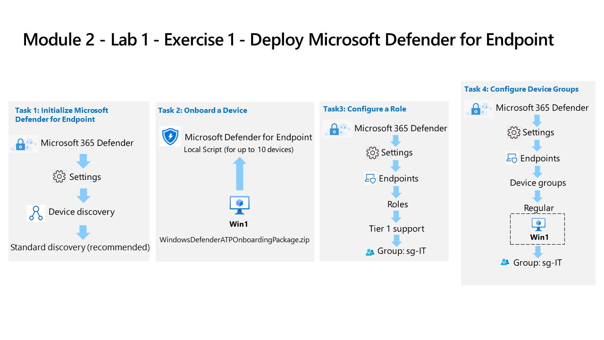

---
lab:
  title: "Ejercicio 1: implementación de Microsoft\_Defender para puntos de conexión"
  module: Learning Path 2 - Mitigate threats using Microsoft Defender for Endpoint
---

# Ruta de aprendizaje 2 - Laboratorio 1 - Ejercicio 1: implementación de Microsoft Defender para puntos de conexión

## Escenario del laboratorio

Es un analista de operaciones de seguridad que trabaja en una empresa que está implementando Microsoft Defender para punto de conexión. El administrador tiene previsto incorporar algunos dispositivos para dar información sobre los cambios necesarios en los procedimientos de respuesta del equipo de SecOps.

Para empezar, inicializa el entorno de Defender para puntos de conexión. Debes empezar inicializando el entorno de Defender para puntos de conexión. Luego incorpora los dispositivos iniciales para la implementación mediante la ejecución del script de incorporación en los dispositivos. Configure la seguridad para el entorno. Por último crea grupos de dispositivos y asigna los dispositivos adecuados.

>**Importante:** las máquinas virtuales de laboratorio se usan a través de diferentes módulos. GUARDA las máquinas virtuales. Si sales del laboratorio sin guardarlo, deberás volver a ejecutar algunas configuraciones de nuevo.

>**Nota:** asegúrate de que has completado correctamente la tarea 3 del módulo anterior.

### Tarea 1: inicialización de Microsoft Defender para puntos de conexión

En esta tarea, realizará la inicialización de Microsoft Defender para punto de conexión.

1. Inicia sesión en la máquina virtual **WIN1** como administrador con la contraseña: **Pa55w.rd**.  

1. Si aún no está en el portal de Microsoft Defender XDR, inicie el explorador Microsoft Edge.

1. En el explorador Microsoft Edge, ve al portal de Defender XDR en (<https://security.microsoft.com>).

1. En el cuadro de diálogo **Iniciar sesión**, copia y pega la cuenta de correo electrónico del inquilino del nombre de usuario de administrador que ha facilitado el proveedor de hospedaje de laboratorio y luego selecciona **Siguiente**.

1. En el cuadro de diálogo **Escribir contraseña**, copia y pega la contraseña de inquilino del administrador que ha facilitado el proveedor de hospedaje del laboratorio y luego selecciona **Iniciar sesión**.

    >**Sugerencia:** la cuenta de correo electrónico del inquilino del administrador y la contraseña se pueden encontrar en la pestaña Recursos.

1. En el portal de **Defender XDR**, en el menú de navegación de la izquierda, desplázate hacia abajo, expande la sección **Sistema** y selecciona **Configuración**.

    >**Nota:** Puede que algunas versiones del portal no tengan la opción **Configuración** en la sección **Sistema**. La opción **Configuración** puede aparecer agrupada con *Informes* y *Auditoría*.

1. En la página de menú Configuración, selecciona **Detección de dispositivos**.

    >**Nota:** si no ves la opción **Detección de dispositivos** en **Configuración**, cierra la sesión seleccionando el círculo superior derecho con las iniciales de la cuenta y selecciona **Cerrar sesión**. Otra opción que puedes intentar es actualizar la página con Ctrl+F5 o abrir la página en modo InPrivate. Vuelva a iniciar sesión con las credenciales de **Correo electrónico del inquilino**.

1. En Configuración de detección, asegúrese de que la opción **Detección estándar (recomendada)** esté seleccionada. 

    >**Sugerencia:** si no ves la opción, actualiza la página.

### Tarea 2: incorporar un dispositivo

En esta tarea, incorporarás un dispositivo para Microsoft Defender para puntos de conexión mediante un script de incorporación.

1. En el portal de **Defender XDR**, en el menú de navegación de la izquierda, desplázate hacia abajo, expande la sección **Sistema** y selecciona **Configuración**; luego, en la página de Configuración, selecciona **Puntos de conexión**.

1. Selecciona **Incorporación** en la sección Administración de dispositivos.

    >**Nota:** también puedes realizar la incorporación de dispositivos en la sección **Recursos** de la barra de menús de la izquierda. Expande Recursos y selecciona Dispositivos. En la página Inventario de dispositivos, con equipos y móviles seleccionados, desplázate hacia abajo hasta **Incorporar dispositivos.** De esta forma pasas a la página **Configuración > Puntos de conexión**.

1. En el "1. Al incorporar un área de dispositivo asegúrate de que, en el menú desplegable Método de implementación, aparezca "Script local (para un máximo de 10 dispositivos)" y selecciona el botón **Descargar paquete de incorporación**.

1. En la ventana emergente *Descargas*, resalta el archivo "WindowsDefenderATPOnboardingPackage.zip" con el mouse y selecciona el icono de carpeta** Mostrar en carpeta**. **Sugerencia:** en caso de que no la veas, el archivo debe estar en el directorio c:\users\admin\downloads.

    >**Sugerencia:** si el explorador bloquea la descarga, realiza una acción en el explorador para permitirla. En el Explorador Microsoft Edge, puedes ver el mensaje "*WindowsDefenderATPOnboardingPackage.zip no se descarga normalmente. Asegúrese de que confía en...*, selecciona el botón de puntos suspensivos (...) si es necesario y luego selecciona **Mantener**. En Microsoft Edge aparece un segundo elemento emergente con el mensaje "*Asegúrese de que confía en WindowsDefenderATPOnboardingPackage.zip antes de abrirlo*", selecciona **Mostrar más** para expandir las selecciones y selecciona **Mantener de todos modos**.

1. Haz clic con el botón derecho en el archivo ZIP descargado y selecciona **Extraer todo...**, asegúrate de que la opción *Mostrar archivos extraídos cuando haya finalizado* esté marcada y selecciona **Extraer**.

1. Haz clic con el botón derecho en el archivo extraído "WindowsDefenderATPLocalOnboardingScript.cmd" y selecciona **Propiedades**. Selecciona la casilla **Desbloquear** en la parte inferior derecha de las ventanas Propiedades y selecciona **Aceptar**.

1. Haz clic con el botón derecho en el archivo extraído "WindowsDefenderATPLocalOnboardingScript.cmd" de nuevo y elige **Ejecutar como administrador**.  **Sugerencia:** si encuentras la ventana SmartScreen de Windows, selecciona **Más información** y elige **Ejecutar de todos modos**.

1. Cuando aparece la ventana "Control de cuentas de usuario", selecciona **Sí** para permitir que el script se ejecute y responde **Y** a la pregunta presentada por el script, y presiona **Entrar**. Cuando hayas terminado, deberías ver un mensaje en la pantalla de comandos que indica *Máquina incorporada correctamente en Microsoft Defender para puntos de conexión*.

1. Presione cualquier tecla para continuar. Esto cierra la ventana del símbolo del sistema.

### Tarea 3: configurar roles

En esta tarea, configurarás los roles para usarlos con grupos de dispositivos.

1. En la barra de menú izquierda del portal de Microsoft Defender XDR, expande la sección **Sistema**, selecciona **Configuración** y luego selecciona **Puntos de conexión**.

    >**Nota:** Puede que algunas versiones del portal no tengan la opción **Configuración** en la sección **Sistema**. La opción **Configuración** puede aparecer agrupada con *Informes* y *Auditoría*.

1. Selecciona **Roles** en la sección de permisos.

1. Seleccione el botón **Activar roles**.

1. Seleccione **+Agregar rol**.

1. En el cuadro de diálogo Añadir rol, introduce las siguientes opciones:

    |Configuración general|Value|
    |---|---|
    |Nombre de rol|**Soporte técnico de nivel 1**|
    |Permisos|Funciones avanzadas de respuesta dinámica|

1. Seleccione **Siguiente**.

1. En la página **Grupos de usuario asignado**, escribe **sg-IT** en el formulario *Filtrar grupos de usuarios* y luego selecciona **Agregar grupos seleccionados**. Asegúrate de que aparezca en *Grupos de usuarios de Azure AD con este rol*.

1. Selecciona **Enviar** y después, **Listo** cuando termines.

    >**Nota:** si recibes el error *"El usuario no puede realizar esta acción, ya que userAuthEnforcementMode es Rbac y esta acción requiere una de las siguientes acciones: RbacV2",* selecciona **Aceptar** y prueba otra vez.

### Tarea 4: configurar los grupos de dispositivos

En esta tarea, configurarás los grupos de dispositivos que permiten el control de acceso y la configuración de automatización.

1. En la barra de menú izquierda del portal de Microsoft Defender XDR, expande la sección **Sistema**, selecciona **Configuración** y luego selecciona **Puntos de conexión**.

1. Selecciona **Grupos de dispositivos** en el área de permisos.

1. Selecciona el icono **+ Agregar grupo de dispositivos**.

1. En la pestaña General, escribe la siguiente información:

    |Configuración general|Value|
    |---|---|
    |Nombre del grupo de dispositivos|**Regular**|
    |Nivel de corrección|Completo: corregir las amenazas automáticamente|

1. Seleccione **Siguiente**.

1. En la pestaña Dispositivos, para la condición del sistema operativo, selecciona **Windows 10** y **Siguiente**.

    >**Nota:** algunos proveedores de hospedaje de laboratorio pueden haber configurado imágenes de *Windows 11* para WIN1. Puedes seleccionar una de las dos opciones siguientes:

1. En la pestaña Vista previa de dispositivos, el botón *Mostrar vista previa* podría mostrar la máquina virtual WIN1, pero lo más probable es que los datos no se hayan rellenado todavía. Seleccione **Siguiente** para continuar.

1. En la pestaña Acceso de usuario, selecciona **sg-IT** y luego selecciona el botón **Agregar grupos seleccionados**. Asegúrate de que aparezca en *Grupos de usuarios de Azure AD con acceso a este grupo de dispositivos*.

1. Selecciona **Enviar** y después, **Listo** cuando termines.

1. La configuración del grupo de dispositivos ha cambiado. Selecciona **Aplicar cambios** para comprobar las coincidencias y recalcular las agrupaciones.

1. Ahora tendrás dos grupos de dispositivos; "Normal" que acabas de crear y "Dispositivos sin agrupar (valor predeterminado)" con el mismo nivel de corrección.

## Continúa con el ejercicio 2
