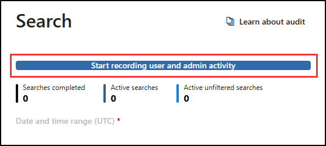

---
lab:
  title: 'Ejercicio 1: Exploración de registros de Auditoría de Microsoft Purview'
  module: Learning Path 3 - Mitigate threats using Microsoft Purview
---

# Ruta de aprendizaje 3 - Laboratorio 1 - Ejercicio 1: Exploración de registros de Auditoría de Microsoft Purview

## Escenario del laboratorio

Eres un analista de operaciones de seguridad que trabaja en una empresa que está implementando Microsoft Defender XDR y Microsoft Purview. Estás ayudando a los compañeros del equipo de cumplimiento de TI a configurar Purview Audit (Estándar) y Auditoría (Premium). El objetivo es garantizar que todos los accesos y modificaciones de los datos de los pacientes en nuestra red de centros sanitarios se registren con precisión para cumplir las normativas de protección de datos sanitarios.

>[!alert] Si recibes un mensaje de error y no puedes iniciar el registro de auditoría en este ejercicio, sigue estos pasos como una solución alternativa:
>
>1. Escribe *PowerShell* en el formulario de Windows Search para abrir una sesión de PowerShell con privilegios elevados y luego selecciona **Ejecutar como administrador**.
>1. Ejecuta `Install-Module -Name ExchangeOnlineManagement` para instalar el módulo ExchangeOnlineManagement
>1. Ejecuta `Connect-ExchangeOnline` para conectarte a ExchangeOnlineManagement
>1. Cuando se te solicite, inicia sesión escribiendo el nombre de usuario del administrador y la contraseña del proveedor de hospedaje del laboratorio.
>1. Para comprobar si la auditoría está habilitada, ejecuta `Get-AdminAuditLogConfig | FL UnifiedAuditLogIngestionEnabled`
>1. Si es false, el registro de auditoría está desactivado.
>1. Para habilitar la auditoría, ejecuta `Set-AdminAuditLogConfig -UnifiedAuditLogIngestionEnabled $true`
>1. Si recibes un error que no puedes ejecutar el script en tu organización, ejecuta `Enable-OrganizationCustomization`
>1. Inténtalo de nuevo para ejecutar `Set-AdminAuditLogConfig -UnifiedAuditLogIngestionEnabled $true`
>1. Para confirmar que la auditoría está habilitada, ejecuta `Get-AdminAuditLogConfig | FL UnifiedAuditLogIngestionEnabled`
>1. Una vez completado, ejecuta `Disconnect-ExchangeOnline` para finalizar la sesión.

### Tiempo estimado para completar este laboratorio: 15 minutos

### Tarea 1: Habilitación de registros de Auditoría de Purview

En esta tarea, asignarás directivas de seguridad preestablecidas para Exchange Online Protection (EOP) y Microsoft Defender para Office 365 en el portal de Seguridad de Microsoft 365.

1. Inicia sesión en la máquina virtual WIN1 como administrador con la contraseña: **Pa55w.rd**.  

1. Abre el explorador Microsoft Edge.

1. En el explorador Microsoft Edge, ve al portal de Microsoft Defender XDR en <https://security.microsoft.com>.

1. En el cuadro de diálogo **Iniciar sesión**, copia y pega la cuenta de correo electrónico del inquilino del nombre de usuario de administrador que ha facilitado el proveedor de hospedaje de laboratorio y luego selecciona **Siguiente**.

1. En el cuadro de diálogo **Escribir contraseña**, copia y pega la contraseña de inquilino del administrador que ha facilitado el proveedor de hospedaje del laboratorio y luego selecciona **Iniciar sesión**.

1. En el menú de navegación, expande *Tecnología operativa* y selecciona **Más recursos**.

1. En el panel **Más recursos**, selecciona el botón **Abrir** en el icono de *Microsoft Purview portal*.

1. Cuando se abra Microsoft Purview portal, aparece un mensaje que indica que *se retira el portal de cumplimiento*. Este mensaje expirará y te redirigirá al nuevo *Microsoft Purview portal*.

1. En el mensaje *Bienvenido al nuevo Microsoft Purview portal*, selecciona la opción para aceptar los términos de divulgación del flujo de datos y la declaración de privacidad y, después, selecciona **Probar ahora**.

    

1. Selecciona **Soluciones** en la barra lateral izquierda y, después, selecciona **Auditar**.

1. En la página de **búsqueda**, selecciona la barra azul **Iniciar grabación de usuarios y actividad de administrador** para habilitar el registro de auditoría.

    

1. Una vez que selecciones esta opción, la barra azul debe desaparecer de esta página.

    >**Nota:** Puede tardar 60 minutos en iniciar la grabación de actividades.

## Has completado el laboratorio
