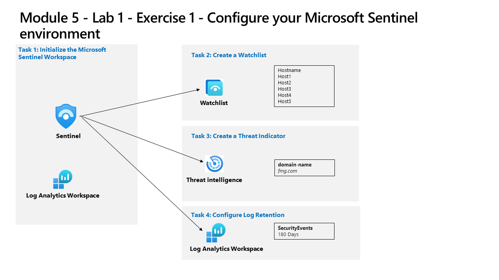

---
lab:
  title: "Ejercicio 1: configuración del entorno de Microsoft\_Sentinel"
  module: Learning Path 5 - Configure your Microsoft Sentinel environment
---

# Ruta de aprendizaje 5 - Laboratorio 1 - Ejercicio 1: configuración del entorno de Microsoft Sentinel

## Escenario del laboratorio



Usted es un analista de operaciones de seguridad que trabaja en una empresa que implementa Microsoft Sentinel. Eres responsable de configurar el entorno de Microsoft Sentinel para cumplir los requisitos de la empresa de minimizar los costes, satisfacer las normas de cumplimiento y brindar el entorno más fácil de administrar para que el equipo de seguridad desempeñe sus responsabilidades de trabajo diarias.

>**Nota:** Hay disponible una **[simulación de laboratorio interactiva](https://mslabs.cloudguides.com/guides/SC-200%20Lab%20Simulation%20-%20Configure%20your%20Microsoft%20Sentinel%20environment)** que le permite realizar sus propias selecciones a su entera discreción. Es posible que encuentre pequeñas diferencias entre la simulación interactiva y el laboratorio hospedado, pero las ideas y los conceptos básicos que se muestran son los mismos. 


### Tarea 1: inciar el área de trabajo de Microsoft Sentinel

En esta tarea, crearás un área de trabajo de Microsoft Sentinel.

1. Inicia sesión en la máquina virtual **WIN1** como administrador con la contraseña: **Pa55w.rd**.  

1. Abre el explorador Edge.

1. En el explorador Edge, ve a Azure Portal en https://portal.azure.com.

1. En el cuadro de diálogo **Iniciar sesión**, copia y pega la cuenta **Correo electrónico de inquilino** que ha facilitado el proveedor de hospedaje de laboratorio y luego selecciona **Siguiente**.

1. En el cuadro de diálogo **Escribir contraseña**, copia y pega la **Contraseña de inquilino** que ha facilitado el proveedor de hospedaje de laboratorio y luego selecciona **Iniciar sesión**.

1. En la barra de búsqueda de Azure Portal, escribe *Sentinel* y luego selecciona **Microsoft Sentinel**.

1. Seleccione **+ Create** (+ Crear).

1. Después, selecciona el área de trabajo de Log Analytics que has creado anteriormente, por ejemplo, *uniquenameDefender* y selecciona **Agregar**. La activación puede tardar unos minutos.

    >**Nota:** si no ves un área de trabajo de Log Analytics aquí, consulta el Módulo 3, Ejercicio 1, Tarea 2 para crear una.

1. Navega por el área de trabajo de Microsoft Sentinel recién creada para familiarizarte con las opciones de la interfaz de usuario.


### Tarea 2: crear una lista de reproducción

En esta tarea, crearás una lista de reproducción en Microsoft Sentinel.

1. En el cuadro de búsqueda de la parte inferior de la pantalla de Windows 10, escribe *Bloc de notas*. Selecciona **Bloc de notas** en los resultados.

1. Escribe *Nombre de host* y presiona Entrar para obtener una nueva línea.

1. En la fila 2 del Bloc de notas, copia los siguientes nombres de host, cada uno de ellos en una línea diferente:

    ```Notepad
    Host1
    Host2
    Host3
    Host4
    Host5
    ```

1. En el menú, selecciona **Archivo - Guardar como**, asigna al archivo el nombre *HighValue.csv*, cambia el tipo de archivo a **Todos los archivos(*.*)** y selecciona **Guardar**. **Sugerencia:** el archivo se puede guardar en la carpeta *Documentos*.

1. Cierre el Bloc de notas.

1. En Microsoft Sentinel, selecciona la opción **Lista de control** en el área Configuración.

1. Selecciona **+ Agregar nuevo** en la barra de comandos.

1. En el Asistente para lista de seguimiento, escribe lo siguiente:

    |Configuración general|Valor|
    |---|---|
    |Nombre|**HighValueHosts**|
    |Descripción|**Hosts de alto valor**|
    |Alias de lista de reproducción|**HighValueHosts**|

1. Selecciona **Siguiente: Origen >**.

1. Selecciona **Buscar archivos** en *Cargar archivo* y busca el archivo *HighValue.csv* que acabas de crear.

1. En el *campo SearchKey* selecciona **Nombre de host**.

1. Selecciona **Siguiente: Revisar y crear >**.

1. Revisa la configuración y luego selecciona **Crear**.

1. La pantalla vuelve a la página de lista de control.

1. Selecciona la lista de reproducción *HighValueHosts* y, en el panel derecho, selecciona **Ver en los registros**.

    >**Importante:** la lista de reproducción puede tardar hasta diez minutos en aparecer. **Continúa con la siguiente tarea y ejecuta este comando en el siguiente laboratorio**.
    
    >**Nota:** ahora puedes usar _GetWatchlist("HighValueHosts") en tus propias instrucciones KQL para acceder a la lista. La columna a la que se va a hacer referencia sería *Nombre de host*.

1. Cierra la ventana *Registros* seleccionando "x" en la parte superior derecha y selecciona **Aceptar** para descartar las modificaciones no guardadas.


### Tarea 3: crear un indicador de amenazas

En esta tarea, crearás un indicador en Microsoft Sentinel.

1. En Microsoft Sentinel, selecciona la opción **Inteligencia sobre amenazas** en el área Administración de amenazas.

1. Selecciona **+ Agregar nuevo** en la barra de comandos.

1. Revisa los distintos tipos de indicador disponibles en la lista desplegable *Tipos*. Selecciona **Nombre de dominio**. 

1. Para el dominio, escribe el nombre del dominio; por ejemplo, *contoso.com*.

1. *En Tipos de amenazas*, selecciona **+ Agregar** y escribe **actividad malintencionada**. Seleccione **Aceptar**.

1. Escriba una **Descripción**.

1. En **Nombre**, escribe el mismo valor usado para el dominio.

1. Establece el campo **Válido del** hasta la fecha de hoy.

1. Seleccione **Aplicar**.

1. Selecciona la opción **Registros** en el área General. Es posible que quieras deshabilitar la opción "Mostrar siempre las consultas" y cerrar la ventana *Consultas* para ejecutar las instrucciones KQL.

1. Ejecuta la instrucción KQL siguiente:

    ```KQL
    ThreatIntelligenceIndicator
    ```

    >**Nota:** el indicador puede tardar hasta cinco minutos en aparecer.

1. Desplázate a la derecha para ver la columna DomainName. También puedes ejecutar la siguiente instrucción KQL para ver simplemente la columna DomainName. 

    ```KQL
    ThreatIntelligenceIndicator 
    | project DomainName
    ```


### Tarea 4: configurar la retención de registros

En esta tarea, cambiarás el período de retención de la tabla SecurityEvent.

1. En Microsoft Sentinel, en el menú **Configuración** de la izquierda, selecciona *Configuración*.

1. Seleccione **Configuración del área de trabajo**.

1. En el área de trabajo de Log Analytics, selecciona la opción **Tablas** en el área *Configuración*.

1. Busca y selecciona la tabla **SecurityEvent** y luego selecciona el botón de puntos suspensivos (...).

1. Selecciona **Administrar tabla**.

1. Selecciona **180 días** para *Período total de retención*. Observa que el *Período de archivado* es de solo 150 días, ya que usa 30 días a partir de la *Retención interactiva*. 

1. Seleccione **Guardar** para aplicar los cambios.


## Has completado el laboratorio.
