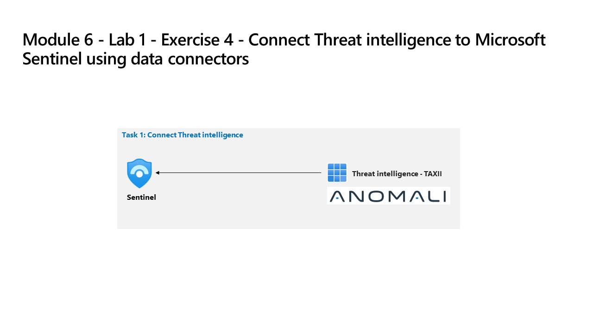

---
lab:
  title: 'Ejercicio 4: Conexión de Defender XDR a Microsoft Sentinel mediante conectores de datos'
  module: Learning Path 6 - Connect logs to Microsoft Sentinel
---

# Ruta de aprendizaje 6: Laboratorio1: Ejercicio 4: Conexión de Defender XDR a Microsoft Sentinel mediante conectores de datos

## Escenario del laboratorio

Es analista de operaciones de seguridad que trabaja en una empresa que implementó Microsoft Defender XDR y Microsoft Sentinel. Debe prepararse para la plataforma de operaciones de seguridad unificada que conecta Microsoft Sentinel a Defender XDR. El siguiente paso será instalar la solución centro de contenido de Defender XDR e implementar el conector de datos de Defender XDR en Microsoft Sentinel.

>**Importante:** Tenga en cuenta que hay diferencias de funcionalidad entre el portal de Azure Microsoft Sentinel y Sentinel en el portal de Microsoft Defender XDR **[Diferencias de funcionalidad del portal](https://learn.microsoft.com/azure/sentinel/microsoft-sentinel-defender-portal#capability-differences-between-portals)**.

### Tarea 1: Conexión de Defender XDR

En esta tarea, implementará el conector de Microsoft Defender XDR.

1. Inicia sesión en la máquina virtual WIN1 como administrador con la contraseña: **Pa55w.rd**.  

1. En el explorador Microsoft Edge, vaya a Azure Portal en (<https://portal.azure.com>).

1. En el cuadro de diálogo **Iniciar sesión**, copia y pega la cuenta **Correo electrónico de inquilino** que ha facilitado el proveedor de hospedaje de laboratorio y luego selecciona **Siguiente**.

1. En el cuadro de diálogo **Escribir contraseña**, copia y pega la **Contraseña de inquilino** que ha facilitado el proveedor de hospedaje de laboratorio y luego selecciona **Iniciar sesión**.

1. En la barra de búsqueda de Azure Portal, escribe *Sentinel* y luego selecciona **Microsoft Sentinel**.

1. Selecciona el área de trabajo de Microsoft Sentinel que has creado anteriormente.

1. En el menú izquierdo de Microsoft Sentinel, desplázate hacia abajo hasta la sección **Administración de contenido** y selecciona **Centro de contenido**.

1. En *Centro de contenido*, busque la solución ** Microsoft Defender XDR** y selecciónela en la lista.

1. En la página de detalles de la solución de *Microsoft Defender XDR*, seleccione **Instalar**.

1. Cuando se complete la instalación, busque la solución **Microsoft Defender XDR** y selecciónela.

1. En la página de detalles de la solución de *Microsoft Defender XDR*, seleccione **Administrar**

>**Nota:** La solución *Microsoft Defender XDR* instala el conector de datos de *Microsoft Defender XDR*, las consultas de búsqueda, los libros y las reglas de análisis.

1. Active la casilla Conector de datos de *Microsoft Defender XDR* y seleccione la **página Abrir conector**.

1. En la sección *Configuración*, en la pestaña *Instrucciones*, **anule la selección** de la casilla para *Desactivar todas las reglas de creación de incidentes de Microsoft para estos productos. Recomendado*, y seleccione el botón **Conectar incidentes y alertas**.

1. Debería recibir un mensaje que indique que la conexión ha sido satisfactoria.

### Tarea 2: Conectar Microsoft Sentinel y Microsoft Defender XDR

En esta tarea, conectará un área de trabajo de Microsoft Sentinel a Microsoft Defender XDR.

>**Nota:** Microsoft Sentinel en el portal de Microsoft Defender XDR está en versión preliminar pública y la experiencia de la interfaz de usuario y los pasos pueden diferir de las instrucciones del laboratorio.

1. Inicie sesión en la máquina virtual **WIN1** como *Administrador* con la contraseña: **Pa55w.rd**.  

1. Abre el explorador Microsoft Edge.

1. En el navegador Edge, vaya al portal de Microsoft Defender XDR en (https://security.microsoft.com).

1. En el cuadro de diálogo **Iniciar sesión**, copia y pega la cuenta de correo electrónico del inquilino del nombre de usuario de administrador que ha facilitado el proveedor de hospedaje de laboratorio y luego selecciona **Siguiente**.

1. En el cuadro de diálogo **Escribir contraseña**, copia y pega la contraseña de inquilino del administrador que ha facilitado el proveedor de hospedaje del laboratorio y luego selecciona **Iniciar sesión**.

    >**Sugerencia:** la cuenta de correo electrónico del inquilino del administrador y la contraseña se pueden encontrar en la pestaña Recursos.

1. En la pantalla **Inicio** del portal de **Defender XDR**, debería ver un banner en la parte superior con el mensaje *Obtener SIEM y XDR en un solo lugar*. Seleccione el botón **Conectar un área de trabajo**.

1. En la página *Elegir un área de trabajo*, seleccione el área de trabajo de **Microsoft Sentinel** que creó anteriormente.

    >**Sugerencia:** Debe tener un nombre como *uniquenameDefender*.

1. Haga clic en el botón **Siguiente**.

    >**Nota:** Si el botón *Siguiente* está deshabilitado o atenuado, y ve un mensaje de error que indica que el área de trabajo de Microsoft Sentinel *no está incorporada* a Defender XDR, intente actualizar la página del portal de Defender XDR, ya que puede tardar entre 5 y 10 minutos en sincronizarse.

1. En la página *Revisar cambios*, compruebe que la selección del *Área de trabajo* sea correcta y revise los elementos con viñetas en la sección *Qué esperar cuando el área de trabajo esté conectada*. Seleccione el botón **Conectar**.

1. Debería ver un mensaje *Conectar el área de trabajo* seguido de un mensaje *Área de trabajo conectada correctamente*.

1. Seleccione el botón **Cerrar**. 

1. En la pantalla **Inicio** del portal de **Defender XDR**, debería ver un banner en la parte superior con el mensaje, *Su SIEM unificado y XDR están listos*. Seleccione el botón **Iniciar búsqueda**.

1. En *Búsqueda avanzada*, debería ver un mensaje para "Explorar el contenido de Sentinel". En el panel de menús izquierdo, note las tablas, funciones y consultas de *Microsoft Sentinel* en las pestañas correspondientes.

1. Expanda el panel de menús principal izquierdo si se contrae y expanda los nuevos elementos de menú de **Microsoft Sentinel**. Debería ver las selecciones *Administración de amenazas*, *Administración de contenido* y *Configuración*.

 >**Nota:** Es posible que algunas características no estén disponibles en la versión preliminar pública y la interfaz de usuario puede diferir de las instrucciones del laboratorio. Además, la sincronización entre Microsoft Sentinel y Microsoft Defender XDR puede tardar unos minutos en completarse, por lo que es posible que no vea todos los *Conectores de datos* instalados, por ejemplo.

## Ha completado el laboratorio
