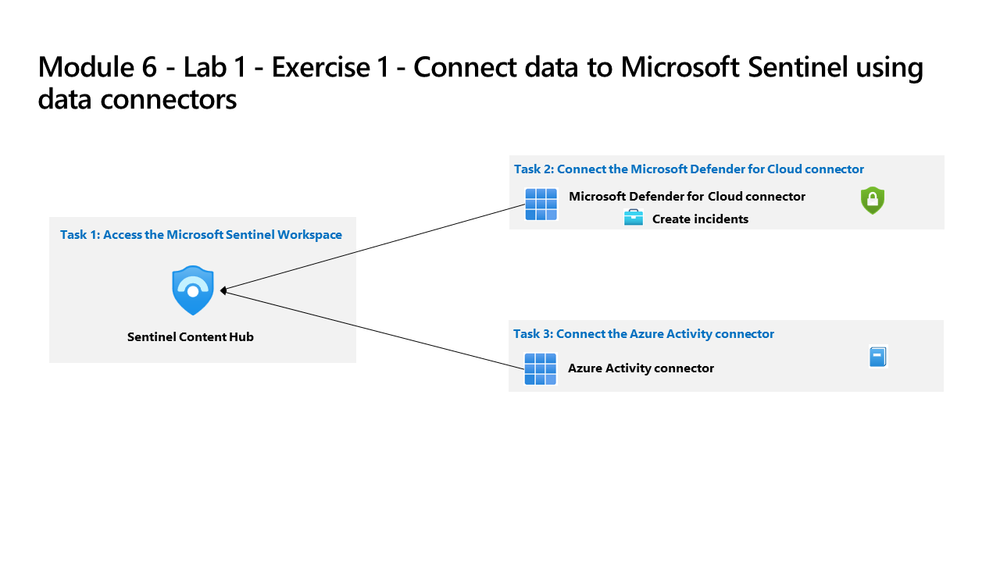

---
lab:
  title: "Ejercicio 1: conexión de datos a Microsoft\_Sentinel mediante conectores de datos"
  module: Learning Path 8 - Connect logs to Microsoft Sentinel
---

# Ruta de aprendizaje 8 - Laboratorio 1 - Ejercicio 1: conexión de datos a Microsoft Sentinel mediante conectores de datos

## Escenario del laboratorio

Eres un analista de operaciones de seguridad que trabaja en una empresa que ha implementado Microsoft Sentinel. Debes aprender a conectar los datos de registro de los numerosos orígenes de datos de la organización. La organización tiene datos de Microsoft 365, Microsoft 365 Defender, recursos de Azure, máquinas virtuales que no son de Azure, etc. Primero empezarás a conectar los orígenes de Microsoft.

>**Importante:** Los ejercicios de laboratorio de la ruta de aprendizaje n.º 8 se encuentran en un entorno *independiente*. Si sales del laboratorio sin completarlo, deberás volver a ejecutar algunas configuraciones de nuevo.

### Tiempo estimado para completar este laboratorio: 20 minutos

### Tarea 1: Acceso al área de trabajo de Microsoft Sentinel

En esta tarea, accederás al área de trabajo de Microsoft Sentinel.

>**Nota:** Microsoft Sentinel se ha preimplementado en la suscripción a Azure con el nombre **defenderWorkspace** y se han instalado las soluciones de *Centro de contenido* necesarias.

1. Inicia sesión en la máquina virtual **WIN1** como administrador con la contraseña: **Pa55w.rd**.  

1. Abre el explorador Microsoft Edge.

1. En el explorador Edge, ve a Azure Portal en <https://portal.azure.com>.

1. En el cuadro de diálogo **Iniciar sesión**, copia y pega la cuenta **Correo electrónico de inquilino** que ha facilitado el proveedor de hospedaje de laboratorio y luego selecciona **Siguiente**.

1. En el cuadro de diálogo **Escribir contraseña**, copia y pega la **Contraseña de inquilino** que ha facilitado el proveedor de hospedaje de laboratorio y luego selecciona **Iniciar sesión**.

1. En la barra de búsqueda de Azure Portal, escribe *Sentinel* y luego selecciona **Microsoft Sentinel**.

1. Selecciona **defenderWorkspace** de Microsoft Sentinel.

1. Continúe con la siguiente tarea.

### Tarea 2: establecer una conexión con el conector de datos de Microsoft Defender for Cloud

En esta tarea, incorporarás y configurarás Microsoft Defender for Cloud.

   <!--- >>**Important:** To *Enable* Bi-directional sync, please rerun  **[Lab 05 Exercise 1](https://microsoftlearning.github.io/SC-200T00A-Microsoft-Security-Operations-Analyst/Instructions/Labs/LAB_AK_05_Lab1_Ex01_Enable_MDC.html)**, Task 2, and select **Setup** from the *Microsoft Defender for Cloud* navigation menu to verify all eligible Azure subscriptions are onboarded. --->

1. En el menú de navegación de Microsoft Sentinel, desplázate hacia abajo hasta la sección **Gestión de contenidos** y selecciona **Centro de contenido**.

1. En el *Centro de contenido*, busca la solución **Microsoft Defender for Cloud** y selecciónala en la lista.

1. En la página de detalles de la solución de *Microsoft Defender for Cloud*, selecciona **Administrar**.

    >**Nota:** la solución de *Microsoft Defender for Cloud* instala el conector de datos de *Microsoft Defender for Cloud basado en suscripciones (heredado)*, el conector de datos *Microsoft Defender for Cloud basado en inquilinos (versión preliminar)* y una regla analítica. El *conector de datos de Microsoft Defender for Cloud (versión preliminar* ) basado en inquilinos se usa cuando un inquilino tiene varias suscripciones.

1. Selecciona la casilla del conector de datos *Microsoft Defender for Cloud basado en suscripciones (heredado)* y haz clic en **Abrir página del conector**.

1. En la sección *Configuración*, **selecciona** la casilla de *MOC Subscription-XXXXXXXXXXX* y selecciona el vínculo **Conectar** o desliza la opción **Estado** a la derecha.

1. Para habilitar la sincronización bidireccional, selecciona el vínculo **Habilitar Microsoft Defender para todas las suscripciones**.

    >**Nota:** Es posible que tengas que desplazarte hacia la derecha para ver el vínculo.

1. En la página *Microsoft Defender for Cloud - Introducción*, la casilla de *MOC Subscription-XXXXXXXXXXX* debe estar seleccionada y el *plan de Microsoft Defender* debe mostrar *Activo - Parcial (30 días de prueba restantes)*.

1. A continuación, selecciona el botón **X (Cerrar)** de la esquina superior derecha para cerrar la página *Introducción*. Debes regresar a la página de configuración de *Microsoft Defender for Cloud*.

1. El *Estado* para *MOC Subscription-XXXXXXXXXXX* debe ser ahora **Conectado** y la *sincronización bidireccional* debe ser *Habilitada*.

    >**Nota:**: es posible que tengas que actualizar la página.

### Tarea 3: establecer una conexión con el conector de datos Actividad de Azure

En esta tarea, configurarás Sentinel para usar el conector de datos *Actividad de Azure*.

1. En el menú de navegación de Microsoft Sentinel, desplázate hacia abajo hasta la sección *Gestión de contenidos* y selecciona **Centro de contenido**.

1. En el *Centro de contenido*, busca la solución **Actividad de Azure** y selecciónala en la lista.

1. En la página de detalles de la solución *Actividad de Azure*, selecciona **Administrar**.

    >**Nota:** la solución *Actividad de Azure* instala el conector de datos *Actividad de Azure*, 13 reglas analíticas, 14 consultas de búsqueda y 1 libro.

1. Selecciona el conector de datos *Actividad de Azure* y luego selecciona **Abrir página del conector**.

1. En el área *Instrucciones*, en la pestaña *Instrucciones*, desplázate hacia abajo hasta "2. Conecta las suscripciones..." y selecciona **Iniciar asistente para asignación de directivas de Azure>**.

1. En la pestaña **Datos básicos**, selecciona el botón de puntos suspensivos (...) en **Ámbito** y selecciona tu suscripción *MOC Subscription-XXXXXXXXXXX* en la lista desplegable y haz clic en **Seleccionar**.

    >**Nota:***No* selecciones un grupo de recursos opcional.

1. Selecciona la pestaña **Parámetros** y elige el área de trabajo *uniquenameDefender* en la lista desplegable **Área de trabajo de Log Analytics**. Esta acción aplicará la configuración de la suscripción para enviar la información al área de trabajo de Log Analytics.

1. Seleccione la pestaña **Corrección** y active la casilla **Crear una tarea de corrección**. Esta acción aplicará la directiva a los recursos de Azure ya existentes.

1. Seleccione el botón **Revisar y crear** para revisar la configuración.

1. Seleccione **Crear** para finalizar.

## Continúa con el ejercicio 2
