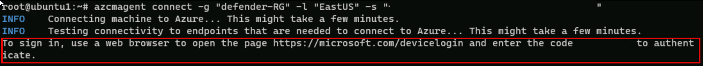

---
lab:
  title: "Ejercicio 3: Conexión de hosts de Linux a Microsoft\_Sentinel mediante conectores de datos"
  module: Learning Path 8 - Connect logs to Microsoft Sentinel
---

# Ruta de aprendizaje 8 - Laboratorio 1 - Ejercicio 3: Conexión de hosts de Linux a Microsoft Sentinel mediante conectores de datos

## Escenario del laboratorio


Eres un analista de operaciones de seguridad que trabaja en una empresa que ha implementado Microsoft Sentinel. Debes aprender a conectar los datos de registro de los numerosos orígenes de datos de la organización. Esto incluye orígenes de datos de máquinas virtuales Linux que usan el formato de vento común (CEF) a través de conectores de Syslog y AMA y de agente heredado.

>**Importante:** Los ejercicios de laboratorio de la ruta de aprendizaje n.º 8 se encuentran en un entorno *independiente*. Si sales del laboratorio sin completarlo, deberás volver a ejecutar algunas configuraciones de nuevo.

### Tiempo estimado para completar este laboratorio: 30 minutos

>**Importante:** hay pasos en las siguientes tareas que se realizan en máquinas virtuales diferentes. Busca las referencias de nombre de máquina virtual.

### Tarea 1: Acceso al área de trabajo de Microsoft Sentinel

En esta tarea, accederás al área de trabajo de Microsoft Sentinel.

>**Nota:** Microsoft Sentinel se ha preimplementado en la suscripción a Azure con el nombre **defenderWorkspace** y se han instalado las soluciones de *Centro de contenido* necesarias.

1. Inicia sesión en la máquina virtual **WIN1** como administrador con la contraseña: **Pa55w.rd**.  

1. Abre el explorador Microsoft Edge.

1. En el explorador Edge, ve a Azure Portal en <https://portal.azure.com>.

1. En el cuadro de diálogo **Iniciar sesión**, copia y pega la cuenta **Correo electrónico de inquilino** que ha facilitado el proveedor de hospedaje de laboratorio y luego selecciona **Siguiente**.

1. En el cuadro de diálogo **Escribir contraseña**, copia y pega la **Contraseña de inquilino** que ha facilitado el proveedor de hospedaje de laboratorio y luego selecciona **Iniciar sesión**.

1. En la barra de búsqueda de Azure Portal, escribe *Sentinel* y luego selecciona **Microsoft Sentinel**.

1. Selecciona **defenderWorkspace** de Microsoft Sentinel.

### Tarea 2: conectarse con un host de Linux mediante el conector de Common Event Format

En esta tarea, conectarás un host de Linux a Microsoft Sentinel con el formato de evento común (CEF) a través del conector de datos AMA. También crearás una regla de recopilación de datos (DCR) para recopilar los eventos. Se instaló Azure Arc previamente en este host de Linux según se necesite para crear un DCR.

1. Inicia la máquina virtual **LIN1**. Inicia sesión con el nombre de usuario y la contraseña que da el host de laboratorio. **Sugerencia:** es posible que tengas que presionar la tecla Entrar para ver el símbolo de sistema de inicio de sesión, y es recomendable apuntar el *nombre de usuario y la contraseña*.

1. Anota la dirección IP del servidor LIN1. Visualiza la captura de pantalla siguiente como ejemplo:

    

1. Vuelve a la máquina virtual **WIN1**. Abre el explorador Microsoft Edge.

1. Inicia Windows PowerShell. Para ello, escribe **Windows PowerShell** en el formulario Buscar en la barra de tareas y, a continuación, selecciona **Windows PowerShell**.

1. Escribe el siguiente comando de PowerShell, ajusta para la información específica del servidor Linux y presione Entrar:

    ```PowerShell
    ssh insert-your-linux-IP-address-here -l insert-linux-user-name-here
    ```

1. Escribe *Sí* para confirmar la conexión, escribe la contraseña del usuario y presiona Entrar. Los resultados deben tener el siguiente aspecto:

    

1. En la sesión SSH, en el símbolo del sistema de Linux, escribe el siguiente comando. *No presiones Entrar*:

    ```cmd
    azcmagent connect -g "defender-RG" -l "EastUS" -s "Subscription ID string"
    ```

1. Reemplaza la **cadena de Id. de suscripción** por el *Id. de suscripción* proporcionado por el host de laboratorio (pestaña*Recursos). Asegúrate de mantener las comillas.

1. Escribe **Entrar** para ejecutar el comando (esto puede tardar un par de minutos).

1. En *Para iniciar sesión, usa un explorador web para abrir la página <https://microsoft.com/devicelogin> y escribe el mensaje de código*, Ctrl+clic en el vínculo para abrir la página de inicio de sesión del dispositivo. Copia el código proporcionado y pégalo en el cuadro *Escribir código para permitir el acceso* y selecciona **Siguiente**.

    

1. En el cuadro de diálogo *Elegir una cuenta*, selecciona el **correo electrónico de inquilino** que ha facilitado el proveedor de hospedaje del laboratorio. Espera al mensaje *Autenticación completa*, cierra la pestaña del explorador y vuelve a la ventana del *símbolo del sistema*. O bien, si ves el cuadro de diálogo *Iniciar sesión*, escribe tu **Correo electrónico de inquilino** y **Contraseña de inquilino** que ha facilitado el proveedor de hospedaje de laboratorio y selecciona **Iniciar sesión**. Espera al mensaje *Autenticación completa*, cierra la pestaña del explorador y vuelve a la ventana del *símbolo del sistema*.

1. Cuando se complete la ejecución de los comandos, deja abierta la ventana del *símbolo del sistema* y escribe el siguiente comando para confirmar que la conexión se realizó correctamente:

    ```cmd
    azcmagent show
    ```

1. En la salida del comando, comprueba que el *estado del agente* sea **Conectado**. Todavía no cierres la ventana de *símbolo de sistema de PowerShell*.

1. Abre el explorador Microsoft Edge.

1. En el explorador Edge, ve a Azure Portal en <https://portal.azure.com>.

1. En el cuadro de diálogo **Iniciar sesión**, copia y pega la cuenta **Correo electrónico de inquilino** que ha facilitado el proveedor de hospedaje de laboratorio y luego selecciona **Siguiente**.

1. En el cuadro de diálogo **Escribir contraseña**, copia y pega la **Contraseña de inquilino** que ha facilitado el proveedor de hospedaje de laboratorio y luego selecciona **Iniciar sesión**.

1. En la barra de búsqueda de Azure Portal, escribe *Sentinel* y luego selecciona **Microsoft Sentinel**.

1. Selecciona **defenderWorkspace** de Microsoft Sentinel.

1. En el menú izquierdo de Microsoft Sentinel, desplázate hacia abajo hasta la sección *Administración de contenido* y selecciona **Centro de contenido**.

1. En el *Centro de contenido*, busca la solución **Common Event Format** y selecciónela en la lista.

1. En la página de la solución *Formato de evento común*, selecciona **Administrar**.

    >**Nota:** la solución *Formato de evento común* instala el *Formato de eventos común (CEF) a través de AMA* y los conectores de datos *Formato de eventos común (CEF) a través del agente heredado*.

1. Selecciona el conector de datos *Common Events Format (CEF) a través de AMA* y selecciona **Abrir página del conector** en la hoja de información del conector.

1. En la sección *Configuración*, selecciona el botón **+Crear regla de recopilación de datos**.

1. En la página *Crear regla de recopilación de datos*, en la pestaña *Básico*, escribe **AZLINDCR** para el Nombre de regla y, a continuación, selecciona **Siguiente: Recursos**.

1. En la pestaña *Recursos*, expande tu *Suscripción a MOC* en *Ámbito*.

    >**Sugerencia:** puedes expandir toda la jerarquía de *Ámbito* seleccionando el signo ">" antes de la columna *Ámbito*.

1. Expande **defender-RG** y selecciona **LIN1**.

    >**Nota:** Es posible que aparezca la máquina virtual *LIN1* con un nombre diferente, como ubuntuxxx.

1. Selecciona **Siguiente: Recopilar**. En la pestaña *Recopilar*, selecciona el menú desplegable *LOG_ALERT* y después **LOG_WARNING**.

1. Selecciona **Siguiente: Revisar y crear** y selecciona **Crear**. Espera a que finalice la implementación.

    >**Nota:**: es posible que tengas que actualizar la página.

1. El *formato de evento común (CEF) a través del conector de datos AMA* ahora debería mostrar **Conectado**.

1. La regla de recopilación de datos instala el agente de Azure Monitor (AMA) y los comandos de instalación del *recopilador CEF* se implementaron previamente en la máquina LIN1 para instalar el recopilador CEF.

1. Vuelve a la ventana del *símbolo del sistema de PowerShell*. Debes estar conectado a la máquina virtual LIN1.

1. En el símbolo del sistema de Linux, escribe lo siguiente y presione entrar:

    ```cmd
    netstat -lnptv
    ```

1. Debería ver rsyslog (o syslog-ng) o el demonio escuchando en el puerto 514.

    >**Nota:** puedes consultar la tabla *CommonSecurityLog* para eventos CEF.

1. Escribe **exit** para cerrar la conexión del shell remoto a LIN1.

### Tarea 3: Establecimiento de una conexión de host de Linux mediante el conector de Syslog

En esta tarea, conectarás un host de Linux a Microsoft Sentinel con el conector de Syslog.

1. Vuelve al explorador Microsoft Edge donde tienes abierto el portal de Microsoft Sentinel y cierra la página del conector de datos "Formato de evento común (CEF) a través de AMA"; para ello, selecciona la opción "x" en la esquina superior derecha.

1. En el menú izquierdo de Microsoft Sentinel, desplázate hacia abajo hasta la sección *Administración de contenido* y selecciona **Centro de contenido**.

1. En el *Centro de contenido*, busca la solución **Syslog** y selecciónala en la lista.

1. En la página de la solución *Syslog*, selecciona **Administrar**.

    >**Nota:** la solución *Syslog* instala dos conectores de datos *Syslog*, 7 reglas de análisis, 9 consultas de búsqueda, 2 analizadores y 21 libros.

1. Selecciona el conector de datos *Syslog a través de agente antiguo* y selecciona **Abrir página del conector** en la hoja de información del conector.

1. En la sección *Configuración*, expande **Instalar agente en una máquina Linux que no sea de Azure**.

1. Selecciona el vínculo **Descargar e instalar el agente de máquinas Linux que no son de Azure**.

    >**Nota:** el área de trabajo de Log Analytics debe mostrar *2 equipos Windows conectados*. Esto corresponde a las máquinas virtuales WINServer y AZWIN01 conectadas anteriormente.

1. Selecciona la pestaña para **servidores Linux**.

    >**Nota:** el área de trabajo de Log Analytics debe mostrar *1 equipos Linux conectados*. Esto corresponde a la máquina virtual LIN1 (ubuntu1) conectada anteriormente con el conector CEF.

1. Selecciona **Instrucciones del agente de Log Analytics**.

1. Copia el comando en el área *Descargar e incorporar agente para Linux* en el portapapeles.

1. Inicia tu máquina virtual LIN2. Inicia sesión con el nombre de usuario como contraseña que ha proporcionado el host de laboratorio. **Sugerencia:** es posible que tengas que presionar la tecla Entrar para ver el símbolo del sistema de inicio de sesión.

1. Anota la dirección IP de tu servidor LIN2. Vea la captura de pantalla siguiente como ejemplo:

    

1. Vuelve a la máquina virtual **WIN1**. Selecciona Windows PowerShell usado en la tarea anterior.

1. Escribe el siguiente comando de PowerShell, ajusta para la información específica del servidor Linux y presione Entrar:

    ```PowerShell
    ssh insert-your-linux-IP-address-here -l insert-linux-user-name-here
    ```

1. Escribe *Sí* para confirmar la conexión, escribe la contraseña del usuario y presiona Entrar. Los resultados deben tener el siguiente aspecto:

    

1. Ya estás listo para pegar el comando *Descargar e incorporar el agente para Linux* del paso anterior. Asegúrate de que el script esté en el portapapeles. En PowerShell, haz clic con el botón derecho en la barra superior y elige **Editar** y después, **Pegar**.

1. Una vez pegado el script, presiona Entrar. El script se ejecutará en el servidor Linux de forma remota. Esperar

1. Cuando termine, escribe **exit** para cerrar la conexión del shell remoto a LIN2.

### Tarea 4: configurar las instalaciones que quieres recopilar y sus gravedades para el conector Syslog.

En esta tarea, configurarás las instalaciones de recopilación de Syslog.

1. Vuelve al explorador Edge donde tienes abierto el portal de Microsoft Sentinel y cierra la página "Área de trabajo de Log Analytics" y la página del conector de datos "Syslog" seleccionando "x" en la esquina superior derecha dos veces.

1. En el portal de Microsoft Sentinel, selecciona **Configuración** en *Configuración* y luego la pestaña **Configuración del área de trabajo **.

1. Selecciona **Administración de agentes heredados** en el área *Clásica*.

1. Selecciona la pestaña **Syslog**.

1. Selecciona el botón **+ Agregar instalación**.

1. Selecciona **Autenticación** en el menú desplegable *Nombre de la instalación*.

1. Vuelve a seleccionar el botón **+ Agregar instalación**.

1. Selecciona **syslog** en el menú desplegable *Nombre de la instalación*.

1. Seleccione **Aplicar** para guardar los cambios.

## Continúa con el ejercicio 4
