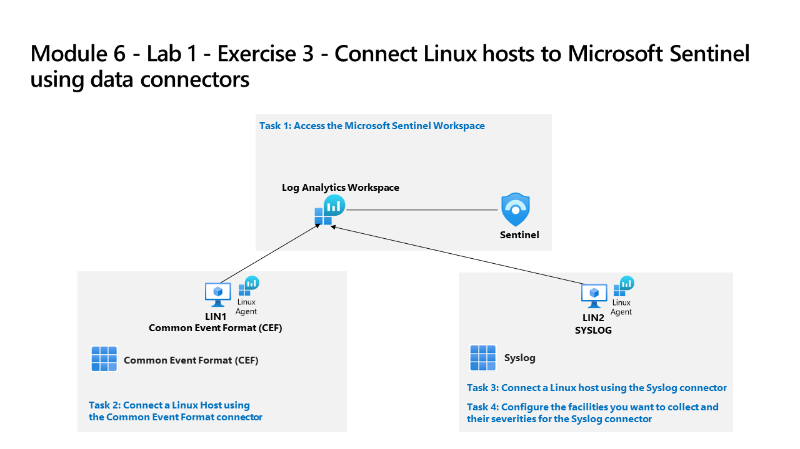
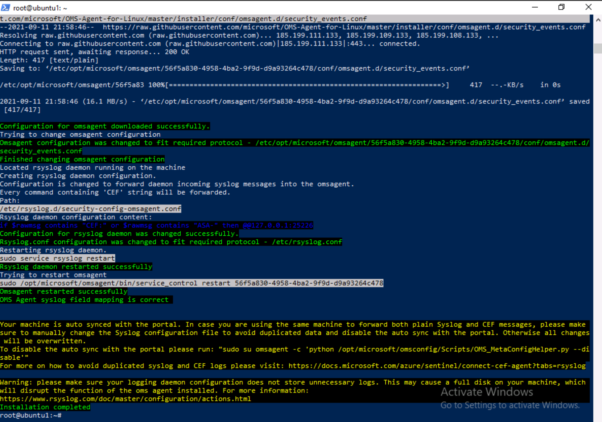

---
lab:
  title: "Ejercicio 3: conexión de hosts de Linux a Microsoft\_Sentinel mediante conectores de datos"
  module: Learning Path 8 - Connect logs to Microsoft Sentinel
---

# Ruta de aprendizaje 8 - Laboratorio 1 - Ejercicio 3: conexión de hosts de Linux a Microsoft Sentinel mediante conectores de datos

## Escenario del laboratorio



Usted es un analista de operaciones de seguridad que trabaja en una empresa que ha implementado Microsoft Sentinel. Debes aprender a conectar los datos de registro de los numerosos orígenes de datos de la organización. El siguiente origen de datos son máquinas virtuales Linux que usan Common Event Formatting (CEF) a través de conectores de Syslog y de agente heredado.

>**Importante:** Los ejercicios de laboratorio de la ruta de aprendizaje n.º 8 se encuentran en un entorno *independiente*. Si sales del laboratorio sin completarlo, deberás volver a ejecutar algunas configuraciones de nuevo.

### Tiempo estimado para completar este laboratorio: 30 minutos

>**Importante:** hay pasos en las siguientes tareas que se realizan en máquinas virtuales diferentes. Busca las referencias de nombre de máquina virtual.

### Tarea 1: acceder al área de trabajo de Microsoft Sentinel

En esta tarea, accederás al área de trabajo de Microsoft Sentinel.

>**Nota:** Microsoft Sentinel se ha preimplementado en la suscripción a Azure con el nombre **defenderWorkspace** y se han instalado las soluciones de *Centro de contenido* necesarias.

1. Inicia sesión en la máquina virtual **WIN1** como administrador con la contraseña: **Pa55w.rd**.  

1. Abre el explorador Microsoft Edge.

1. En el explorador Edge, ve a Azure Portal en <https://portal.azure.com>.

1. En el cuadro de diálogo **Iniciar sesión**, copia y pega la cuenta **Correo electrónico de inquilino** que ha facilitado el proveedor de hospedaje de laboratorio y luego selecciona **Siguiente**.

1. En el cuadro de diálogo **Escribir contraseña**, copia y pega la **Contraseña de inquilino** que ha facilitado el proveedor de hospedaje de laboratorio y luego selecciona **Iniciar sesión**.

1. En la barra de búsqueda de Azure Portal, escribe *Sentinel* y luego selecciona **Microsoft Sentinel**.

1. Selecciona **defenderWorkspace** de Microsoft Sentinel.

### Tarea 2: conectarse con un host de Linux mediante el conector de Common Event Format

En esta tarea, conectarás un host de Linux a Microsoft Sentinel mediante el Common Event Format (CEF) a través del conector del agente heredado.

1. En el menú izquierdo de Microsoft Sentinel, desplázate hacia abajo hasta la sección *Administración de contenido* y selecciona **Centro de contenido**.

1. En el *Centro de contenido*, busca la solución **Common Event Format** y selecciónela en la lista.

1. En la página de la solución *Formato de evento común*, selecciona **Administrar**.

    >**Nota:** la solución *Common Event Format* instala *Common Events Format (CEF) a través de AMA* y los conectores de datos *Common Events Format (CEF)*.

1. Selecciona el conector de datos *Common Events Format (CEF) a través de AMA* y selecciona **Abrir página del conector** en la hoja de información del conector.

1. En la sección *Configuración*, copia en el Portapapeles el comando que se muestra en *Ejecutar el siguiente comando para instalar y aplicar el recopilador CEF:*.

1. Inicia la máquina virtual **LIN1**. Inicia sesión con el nombre de usuario y la contraseña que da el host de laboratorio. **Sugerencia:** es posible que tengas que presionar la tecla Entrar para ver el símbolo de sistema de inicio de sesión, y es recomendable apuntar el *nombre de usuario y la contraseña*.

1. Anota la dirección IP del servidor LIN1. Vea la captura de pantalla siguiente como ejemplo:

    

1. Vuelve a la máquina virtual **WIN1**. Inicia Windows PowerShell. Para ello, escribe **Windows PowerShell** en el formulario Buscar en la barra de tareas y, a continuación, selecciona **Windows PowerShell**.

1. Escribe el siguiente comando de PowerShell, ajusta para la información específica del servidor Linux y presione Entrar:

    ```PowerShell
    ssh insert-your-linux-IP-address-here -l insert-linux-user-name-here
    ```

1. Escribe *Sí* para confirmar la conexión, escribe la contraseña del usuario y presiona Entrar. Los resultados deben tener el siguiente aspecto:

    

1. Ya estás listo para pegar el comando *Ejecutar el siguiente comando para instalar y aplicar el recopilador CEF:* del paso anterior. Asegúrate de que el script de Azure esté en el portapapeles. En la sesión SSH de PowerShell, haz clic con el botón derecho para pegar el comando en el símbolo del sistema.

1. Una vez pegado y antes de presionar *Entrar*, agrega el carácter **3** a la palabra *python* como se muestra a continuación:

    

1. Una vez ajustado el script, presiona Entrar. El script se ejecutará en el servidor Linux de forma remota. Cuando el script procesa correctamente, debe tener un aspecto similar a esta pantalla:

    

    >**Nota:** es posible que la pantalla no sea exactamente como se muestra, pero deberías ver que la *instalación se ha completado correctamente*.

1. Escribe **exit** para cerrar la conexión del shell remoto a LIN1.


### Tarea 3: establecer una conexión de host de Linux mediante el conector de Syslog

En esta tarea, conectarás un host de Linux a Microsoft Sentinel con el conector de Syslog.

1. Vuelve al explorador Microsoft Edge donde tienes abierto el portal de Microsoft Sentinel y cierra la página del conector de datos "Common Event Format (CEF) a través del agente heredado"; para ello, selecciona la opción "x" en la esquina superior derecha.

1. En el menú izquierdo de Microsoft Sentinel, desplázate hacia abajo hasta la sección *Administración de contenido* y selecciona **Centro de contenido**.

1. En el *Centro de contenido*, busca la solución **Syslog** y selecciónala en la lista.

1. En la página de la solución *Syslog*, selecciona **Administrar**.

    >**Nota:** la solución *Syslog* instala dos conectores de datos *Syslog*, 7 reglas de análisis, 9 consultas de búsqueda, 2 analizadores y 21 libros.

1. Selecciona el conector de datos *Syslog a través de agente antiguo* y selecciona **Abrir página del conector** en la hoja de información del conector.

1. En la sección *Configuración*, expande **Instalar agente en una máquina Linux que no sea de Azure**.

1. Selecciona el vínculo **Descargar e instalar el agente de máquinas Linux que no son de Azure**.

    >**Nota:** el área de trabajo de Log Analytics debe mostrar *2 equipos Windows conectados*. Esto corresponde a las máquinas virtuales WINServer y AZWIN01 conectadas anteriormente.

1. Selecciona la pestaña para **servidores Linux**.

    >**Nota:** el área de trabajo de Log Analytics debe mostrar *1 equipos Linux conectados*. Esto corresponde a la máquina virtual LIN1 (ubuntu1) conectada anteriormente con el conector CEF.

1. Selecciona **Instrucciones del agente de Log Analytics**.

1. Copia el comando en el área *Descargar e incorporar agente para Linux* en el portapapeles.

1. Inicia tu máquina virtual LIN2. Inicia sesión con el nombre de usuario como contraseña que ha proporcionado el host de laboratorio. **Sugerencia:** es posible que tengas que presionar la tecla Entrar para ver el símbolo del sistema de inicio de sesión.

1. Anota la dirección IP de tu servidor LIN2. Vea la captura de pantalla siguiente como ejemplo:

    

1. Vuelve a la máquina virtual **WIN1**. Selecciona Windows PowerShell usado en la tarea anterior.

1. Escribe el siguiente comando de PowerShell, ajusta para la información específica del servidor Linux y presione Entrar:

    ```PowerShell
    ssh insert-your-linux-IP-address-here -l insert-linux-user-name-here
    ```

1. Escribe *Sí* para confirmar la conexión, escribe la contraseña del usuario y presiona Entrar. Los resultados deben tener el siguiente aspecto:

    

1. Ya estás listo para pegar el comando *Descargar e incorporar el agente para Linux* del paso anterior. Asegúrate de que el script esté en el portapapeles. En PowerShell, haz clic con el botón derecho en la barra superior y elige **Editar** y después, **Pegar**.

1. Una vez pegado el script, presiona Entrar. El script se ejecutará en el servidor Linux de forma remota. Esperar

1. Cuando termine, escribe **exit** para cerrar la conexión del shell remoto a LIN2.

### Tarea 4: configurar las instalaciones que quieres recopilar y sus gravedades para el conector Syslog.

En esta tarea, configurarás las instalaciones de recopilación de Syslog.

1. Vuelve al explorador Edge donde tienes abierto el portal de Microsoft Sentinel y cierra la página "Área de trabajo de Log Analytics" y la página del conector de datos "Syslog" seleccionando "x" en la esquina superior derecha dos veces.

1. En el portal de Microsoft Sentinel, selecciona **Configuración** en *Configuración* y luego la pestaña **Configuración del área de trabajo **.

1. Selecciona **Administración de agentes heredados** en el área *Clásica*.

1. Selecciona la pestaña **Syslog**.

1. Selecciona el botón **+ Agregar instalación**.

1. Selecciona **Autenticación** en el menú desplegable *Nombre de la instalación*.

1. Vuelve a seleccionar el botón **+ Agregar instalación**.

1. Selecciona **syslog** en el menú desplegable *Nombre de la instalación*.

1. Seleccione **Aplicar** para guardar los cambios.

## Continúa con el ejercicio 4
