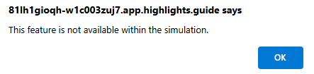

---
lab:
  title: 'Ejercicio 4: Conexión de Defender XDR a Microsoft Sentinel mediante conectores de datos'
  module: Learning Path 8 - Connect logs to Microsoft Sentinel
---

# Ruta de aprendizaje 8- Laboratorio 1: Ejercicio 4: Conexión de XDR de Defender a Microsoft Sentinel mediante conectores de datos

## Escenario del laboratorio

Eres analista de operaciones de seguridad que trabaja en una empresa que implementó Microsoft Defender XDR y Microsoft Sentinel. Debes prepararte para la plataforma de operaciones de seguridad unificada que conecta Microsoft Sentinel a Defender XDR. El siguiente paso será instalar la solución centro de contenido de Defender XDR e implementar el conector de datos de Defender XDR en Microsoft Sentinel.

>**Nota:**  El entorno de este ejercicio es una simulación generada a partir del producto. Al ser una simulación limitada, es posible que los vínculos de alguna página no estén habilitados y que no se admiten las entradas de texto que se encuentren fuera del script especificado. Se mostrará el siguiente mensaje emergente: "Esta característica no está disponible dentro de la simulación".  Cuando esto ocurra, selecciona Aceptar y continúa con los pasos del ejercicio.

### Tarea 1: Conexión de Defender XDR

En esta tarea, implementará el conector de Microsoft Defender XDR.

1. Inicia sesión en la máquina virtual WIN1 como administrador con la contraseña: **Pa55w.rd**.  

1. En el explorador Microsoft Edge, abre el entorno simulado seleccionando este vínculo: **[Azure Portal]( https://app.highlights.guide/start/1c894b46-4b0a-40cb-b0f0-1e1c86c615f3?token=16d48b6c-eace-4a1f-8050-098d29d23a89)**.

1. En la *página principal* de Azure Portal, selecciona el icono de **Microsoft Sentinel**.

1. En la página de *Microsoft Sentinel*, selecciona el área de trabajo **Woodgrove-LogAnalyiticWorkspace**.

1. En el menú izquierdo de Microsoft Sentinel, desplázate hacia abajo hasta la sección **Administración de contenido** y selecciona **Centro de contenido**.

1. En *Centro de contenido*, busca la solución ** Microsoft Defender XDR** y selecciónala en la lista.

1. En la página de detalles de la solución de *Microsoft Defender XDR*, selecciona **Instalar**.

1. Cuando se complete la instalación, busca la solución **Microsoft Defender XDR** y selecciónala.

1. En la página de detalles de la solución de *Microsoft Defender XDR*, selecciona **Administrar**

1. Activa la casilla Conector de datos de *Microsoft Defender XDR* y selecciona la **página Abrir conector**.

1. Deberías recibir un mensaje que indique que la conexión ha sido satisfactoria.

### Tarea 2: Conectar Microsoft Sentinel y Microsoft Defender XDR

En esta tarea, continuarás con la simulación y conectarás un área de trabajo de Microsoft Sentinel a Microsoft Defender XDR.

1. Vuelve al *Centro de contenido* de Microsoft Sentinel (con el vínculo del menú de la "barra de direcciones" situado en la parte superior de la página) y selecciona **Información general (versión preliminar)** en la sección General del menú de navegación.

1. Selecciona el botón **Más información** en el mensaje *Obtener SIEM y XDR en un solo lugar*.

1. Al seleccionar el botón **Más información**, se abre una nueva pestaña en el explorador para el portal de *Microsoft Defender XDR*.

1. En el portal de **Defender**, en la pantalla de **Inicio**, debería aparecer un banner en la parte superior con el mensaje *Obtener SIEM y XDR en un solo lugar*. Selecciona el botón **Conectar un área de trabajo**.

1. En la página *Elegir un área de trabajo*, selecciona el área de trabajo **woodgrove-loganalyiticsworkspace** de Microsoft Sentinel.

1. Seleccione el botón **Siguiente**.

1. En la página **Establecer un área de trabajo principal**, debería aparecer el área de trabajo **woodgrove-loganalyiticsworkspace** de Microsoft Sentinel en el menú desplegable. Seleccione el botón **Siguiente**.

1. En la página *Revisar y finalizar*, comprueba que la selección del *Área de trabajo* es correcta y revisa los elementos con viñetas en la sección *Qué esperar cuando el área de trabajo está conectada*. Selecciona el botón **Conectar**.

1. Deberías ver un mensaje *Estás a punto de conectar un área de trabajo*. Selecciona el botón **Conectar**.

1. Ahora deberías estar en la página *Área de trabajo conectada correctamente*.

1. Selecciona el botón **Cerrar**.

1. En la pantalla **Inicio** del portal de **Defender XDR**, deberías ver un banner en la parte superior con el mensaje, *Su SIEM unificado y XDR están listos*. Selecciona el botón **Iniciar búsqueda**.

1. En *Búsqueda avanzada de amenazas*, debería aparecer un mensaje para "Explorar el contenido de Microsoft Sentinel". En el menú de navegación *Búsqueda avanzada de amenazas*, puedes encontrar las tablas, funciones y consultas de *Microsoft Sentinel* en las pestañas correspondientes.

1. Desplázate hacia abajo en la pestaña **Esquema** hasta el encabezado de **Microsoft Sentinel** y, a continuación, haz doble clic en la tabla **ThreatIntelligenceIndicator**.

1. En el panel *Consulta*, debería aparecer una consulta (KQL) que devuelve indicadores de inteligencia sobre amenazas. Selecciona el botón **Ejecutar consulta**.

1. Deberías ver los resultados devueltos en el panel *Resultados*.

1. Expande el panel de menús principal izquierdo si se contrae y expande los nuevos elementos de menú de **Microsoft Sentinel**. Deberías ver las selecciones de *Búsqueda*, *Administración de amenazas*, *Administración de contenido* y *Configuración*.

    >**Nota:** Tenga en cuenta que hay diferencias de funcionalidad entre el portal de Azure Microsoft Sentinel y Sentinel en el portal de Microsoft Defender XDR **[Diferencias de funcionalidad del portal](https://learn.microsoft.com/azure/sentinel/microsoft-sentinel-defender-portal#capability-differences-between-portals)**.

1. En los elementos de menú de **Microsoft Sentinel** de Microsoft Defender XDR, selecciona **Configuración** y, a continuación, **Conectores de datos**.

1. En la página *Conectores de datos*, deberías ver la **Actividad de Azure** y otros conectores de datos enumerados con un estado **Conectado**.

>**Nota:** No dudes en explorar y comparar las otras funcionalidades de Microsoft Sentinel, pero, como se trata de una simulación, la capacidad de explorar Microsoft Sentinel en el portal de Microsoft Defender está limitada. En un entorno real, podrías explorar todas las funcionalidades de Microsoft Sentinel en el portal de Microsoft Defender.

## Has completado el laboratorio: continúa con la ruta de aprendizaje 9 - Laboratorio 1 - Ejercicio 1 : Modificación de una regla de seguridad de Microsoft
