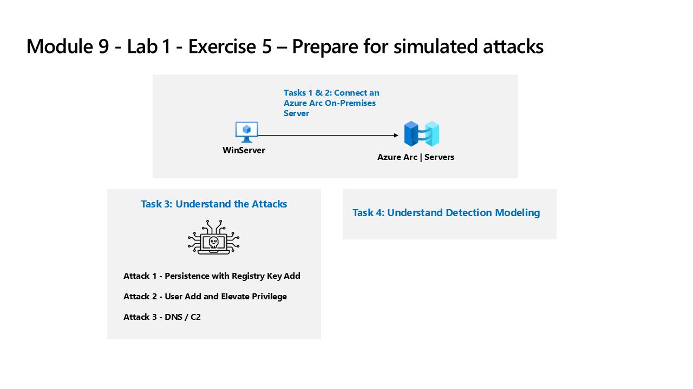

---
lab:
  title: 'Ejercicio 5: Preparación para realizar ataques simulados'
  module: Learning Path 9 - Create detections and perform investigations using Microsoft Sentinel
---

# Ruta de aprendizaje 9- Laboratorio 1- Ejercicio 5: Preparación para realizar ataques simulados

## Escenario del laboratorio



>**Importante:** Los ejercicios de laboratorio de la ruta de aprendizaje n.º 9 se encuentran en un entorno *independiente*. Si sales del laboratorio sin completarlo, deberás volver a ejecutar algunas configuraciones de nuevo.

### Tiempo estimado para completar este laboratorio: 30 minutos

### Tarea 1: conectar a un servidor local

En esta tarea, conectarás un servidor local a tu suscripción a Azure. Azure Arc se instaló previamente en este servidor. El servidor se utilizará en ejercicios posteriores para ejecutar ataques simulados que detectarás e investigarás más adelante en Microsoft Sentinel.

>**Importante:** los pasos siguientes se realizan en una máquina diferente de aquella en la que estabas trabajando anteriormente. Busca el nombre de máquina virtual en la pestaña de referencias.

1. Inicia sesión en la máquina virtual **WINServer** como administrador con la contraseña: **Passw0rd!** si es necesario.  

Como se ha descrito anteriormente, Azure Arc se ha instalado previamente en la máquina **WINServer**. Ahora conectarás esta máquina a tu suscripción a Azure.

1. En la máquina *WINServer*, selecciona el icono de *búsqueda* y escribe **cmd**.

1. En los resultados de la búsqueda, haz clic con el botón derecho en *Símbolo del sistema* y selecciona **Ejecutar como administrador**.

1. En la ventana del símbolo del sistema, escribe el comando siguiente. *No presiones Entrar*:

    ```cmd
    azcmagent connect -g "defender-RG" -l "EastUS" -s "Subscription ID string"
    ```

1. Reemplaza la **cadena de Id. de suscripción** por el *Id. de suscripción* proporcionado por el host de laboratorio (pestaña*Recursos). Asegúrate de mantener las comillas.

1. Escribe **Entrar** para ejecutar el comando (esto puede tardar un par de minutos).

    >**Nota**: si ves la ventana de selección del explorador *¿Cómo deseas abrir esto?*, selecciona **Microsoft Edge**.

1. En el cuadro de diálogo *Iniciar sesión*, escribe tu **Correo electrónico de inquilino** y **Contraseña de inquilino** que ha facilitado el proveedor de hospedaje de laboratorio y selecciona **Iniciar sesión**. Espera al mensaje *Autenticación completa*, cierra la pestaña del explorador y vuelve a la ventana del *símbolo del sistema*.

1. Cuando se complete la ejecución de los comandos, deja abierta la ventana del *símbolo del sistema* y escribe el siguiente comando para confirmar que la conexión se realizó correctamente:

    ```cmd
    azcmagent show
    ```

1. En la salida del comando, comprueba que el *estado del agente* sea **Conectado**.

## Tarea 2: conexión una máquina Windows que no es de Azure

En esta tarea, agregarás una máquina local de Azure Arc conectada a Microsoft Sentinel.  

>**Nota:** Microsoft Sentinel se ha preimplementado en la suscripción a Azure con el nombre **defenderWorkspace** y se han instalado las soluciones de *Centro de contenido* necesarias.

1. Inicia sesión en la máquina virtual **WIN1** como administrador con la contraseña: **Pa55w.rd**.  

1. En el explorador Microsoft Edge, ve a Azure Portal en <https://portal.azure.com>.

1. En el cuadro de diálogo **Iniciar sesión**, copia y pega la cuenta **Correo electrónico de inquilino** que ha facilitado el proveedor de hospedaje de laboratorio y luego selecciona **Siguiente**.

1. En el cuadro de diálogo **Escribir contraseña**, copia y pega la **Contraseña de inquilino** que ha facilitado el proveedor de hospedaje de laboratorio y luego selecciona **Iniciar sesión**.

1. En la barra de búsqueda de Azure Portal, escribe *Sentinel* y luego selecciona **Microsoft Sentinel**.

1. Selecciona **defenderWorkspace** de Microsoft Sentinel.

1. En el menú de navegación izquierdo de Microsoft Sentinel, desplázate hacia abajo hasta la sección *Configuración* y selecciona **Conectores de datos**.

1. En los *Conectores de datos*, busca la solución **Eventos de seguridad de Windows vía AMA** y selecciónala en la lista.

1. En el panel de detalles de *Eventos de seguridad de Windows vía AMA*, selecciona la **página Abrir conector**.

    >**Nota:** la solución *Eventos de seguridad de Windows* instala los *eventos de seguridad de Windows a través de AMA* y los *Eventos de seguridad a través del agente heredado*. Además de 2 libros, 20 reglas analíticas y 43 consultas de búsqueda.

1. En la sección *Configuración*, en la pestaña *Instrucciones*, selecciona **Crear regla de recopilación de datos**.

1. Escribe **AZWINDCR** como Nombre de regla y luego selecciona **Siguiente: recursos**.

1. Expande tu *Suscripción* en *Ámbito* en la pestaña *Recursos*.

    >**Sugerencia:** puedes expandir toda la jerarquía de *Ámbito* seleccionando el signo ">" antes de la columna *Ámbito*.

1. Expande el grupo de recursos **defender-RG** y luego selecciona **WINServer**.

1. Selecciona **Siguiente: Recopilar** y deja seleccionada la opción *Todos los eventos de seguridad*.

1. Seleccione **Siguiente: Review + create** (Revisar y crear).

1. Una vez que aparezca **Validación superada**, selecciona *Crear*.

### Tarea 3: comprensión de los ataques

>**Importante: no realizarás ninguna acción en este ejercicio.**  Estas instrucciones son solo una explicación de los ataques que realizarás en el ejercicio siguiente. Lee detenidamente esta página.

Los patrones de ataque se basan en un proyecto de código abierto: <https://github.com/redcanaryco/atomic-red-team>

#### Ataque 1: persistencia con la agregación de clave del registro

Los atacantes agregarán un programa en la clave Ejecutar registro. De esta manera, se obtiene persistencia haciendo que el programa se ejecute cada vez que el usuario inicia sesión.

```
REG ADD "HKCU\SOFTWARE\Microsoft\Windows\CurrentVersion\Run" /V "SOC Test" /t REG_SZ /F /D "C:\temp\startup.bat"
```

#### Ataque 2: agregación de usuarios y privilegio elevado

Los atacantes agregarán nuevos usuarios y elevarán el nuevo usuario al grupo de administradores. Esto permite al atacante iniciar sesión con una cuenta diferente con privilegios.

```
net user theusernametoadd /add
net user theusernametoadd ThePassword1!
net localgroup administrators theusernametoadd /add
```

#### Ataque 3: DNS / C2

El atacante enviará un gran volumen de consultas DNS a un servidor de comando y control (C2). La intención es desencadenar la detección basada en umbral en el número de consultas DNS desde un único sistema de origen o en un único dominio de destino.

```
param(
    [string]$Domain = "microsoft.com",
    [string]$Subdomain = "subdomain",
    [string]$Sub2domain = "sub2domain",
    [string]$Sub3domain = "sub3domain",
    [string]$QueryType = "TXT",
        [int]$C2Interval = 8,
        [int]$C2Jitter = 20,
        [int]$RunTime = 240
)
$RunStart = Get-Date
$RunEnd = $RunStart.addminutes($RunTime)
$x2 = 1
$x3 = 1 
Do {
    $TimeNow = Get-Date
    Resolve-DnsName -type $QueryType $Subdomain".$(Get-Random -Minimum 1 -Maximum 999999)."$Domain -QuickTimeout
    if ($x2 -eq 3 )
    {
        Resolve-DnsName -type $QueryType $Sub2domain".$(Get-Random -Minimum 1 -Maximum 999999)."$Domain -QuickTimeout
        $x2 = 1
    }
    else
    {
        $x2 = $x2 + 1
    }
    if ($x3 -eq 7 )
    {
        Resolve-DnsName -type $QueryType $Sub3domain".$(Get-Random -Minimum 1 -Maximum 999999)."$Domain -QuickTimeout
        $x3 = 1
    }
    else
    {
        $x3 = $x3 + 1
    }
    $Jitter = ((Get-Random -Minimum -$C2Jitter -Maximum $C2Jitter) / 100 + 1) +$C2Interval
    Start-Sleep -Seconds $Jitter
}
Until ($TimeNow -ge $RunEnd)
```

### Tarea 4: comprensión del modelado de detección

El ciclo de configuración de detección de ataques usado en este laboratorio representa todos los orígenes de datos, aunque solo se centre en dos orígenes de datos específicos.

Para crear una detección, empieza por crear primero una instrucción KQL. Como atacarás a un host, tendrás datos representativos para empezar a compilar la instrucción KQL.

Una vez que tengas la instrucción KQL, crea la regla analítica.

Una vez que la regla se desencadena y crea las alertas e incidentes, investiga para decidir si proporcionas campos que ayuden a los analistas de operaciones de seguridad en su investigación.

Después, realizarás otros cambios en la regla de análisis.

>**Nota:** algunas alertas se desencadenarán en un período más corto solo a los fines de este laboratorio.

## Continúa con el ejercicio 6
