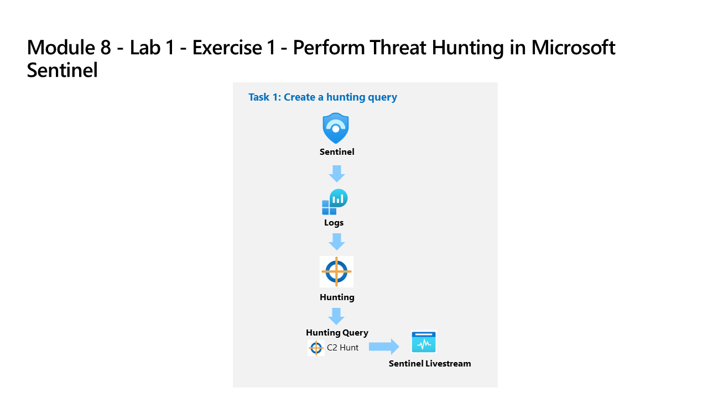

---
lab:
  title: "Ejercicio 1: realización de la búsqueda de amenazas en Microsoft\_Sentinel"
  module: Learning Path 10 - Perform threat hunting in Microsoft Sentinel
---

# Ruta de aprendizaje 10 - Laboratorio 1 - Ejercicio 1: realización de la búsqueda de amenazas en Microsoft Sentinel

## Escenario del laboratorio



Eres un analista de operaciones de seguridad que trabaja en una empresa que ha implementado Microsoft Sentinel. Has recibido inteligencia sobre amenazas referente a una técnica de comando y control (C2 o C&C). Debes realizar una búsqueda y vigilar la amenaza.

>**Importante:** Los ejercicios de laboratorio de la ruta de aprendizaje n.º 10 se encuentran en un entorno *independiente*. Si sales del laboratorio sin completarlo, deberás volver a ejecutar algunas configuraciones de nuevo.

Los datos de registro creados en los ejercicios de laboratorio de la Ruta de aprendizaje 9 no estarán disponibles en este laboratorio sin volver a ejecutar las tareas de requisito previo.

<!--- **[Lab 09 Exercise 5](https://microsoftlearning.github.io/SC-200T00A-Microsoft-Security-Operations-Analyst/Instructions/Labs/LAB_AK_09_Lab1_Ex05_Attacks.html)**

**[Lab 09 Exercise 6](https://microsoftlearning.github.io/SC-200T00A-Microsoft-Security-Operations-Analyst/Instructions/Labs/LAB_AK_09_Lab1_Ex06_Perform_Attacks.html)** --->

### Tiempo estimado para completar este laboratorio: 45 - 60 minutos

### Tarea de requisito previo 1: conectar a un servidor local

En esta tarea, conectarás un servidor local a tu suscripción a Azure. Azure Arc se instaló previamente en este servidor. El servidor se utilizará en ejercicios posteriores para ejecutar ataques simulados que detectarás e investigarás más adelante en Microsoft Sentinel.

>**Importante:** los pasos siguientes se realizan en una máquina diferente de aquella en la que estabas trabajando anteriormente. Busca el nombre de máquina virtual en la pestaña de referencias.

1. Inicia sesión en la máquina virtual **WINServer** como administrador con la contraseña: **Passw0rd!** si es necesario.  

Como se ha descrito anteriormente, Azure Arc se ha instalado previamente en la máquina **WINServer**. Ahora conectarás esta máquina a tu suscripción a Azure.

1. En la máquina *WINServer*, selecciona el icono de *búsqueda* y escribe **cmd**.

1. En los resultados de la búsqueda, haz clic con el botón derecho en *Símbolo del sistema* y selecciona **Ejecutar como administrador**.

1. En la ventana del símbolo del sistema, escribe el comando siguiente. *No presiones Entrar*:

    ```cmd
    azcmagent connect -g "defender-RG" -l "EastUS" -s "Subscription ID string"
    ```

1. Reemplaza la **cadena de Id. de suscripción** por el *Id. de suscripción* proporcionado por el host de laboratorio (pestaña*Recursos). Asegúrate de mantener las comillas.

1. Escribe **Entrar** para ejecutar el comando (esto puede tardar un par de minutos).

    >**Nota**: si ves la ventana de selección del explorador *¿Cómo deseas abrir esto?*, selecciona **Microsoft Edge**.

1. En el cuadro de diálogo *Iniciar sesión*, escribe tu **Correo electrónico de inquilino** y **Contraseña de inquilino** que ha facilitado el proveedor de hospedaje de laboratorio y selecciona **Iniciar sesión**. Espera al mensaje *Autenticación completa*, cierra la pestaña del explorador y vuelve a la ventana del *símbolo del sistema*.

1. Cuando se complete la ejecución de los comandos, deja abierta la ventana del *símbolo del sistema* y escribe el siguiente comando para confirmar que la conexión se realizó correctamente:

    ```cmd
    azcmagent show
    ```

1. En la salida del comando, comprueba que el *estado del agente* sea **Conectado**.

## Tarea de requisito previo 2: conectar una máquina Windows que no es de Azure

En esta tarea, agregarás una máquina local de Azure Arc conectada a Microsoft Sentinel.  

>**Nota:** Microsoft Sentinel se ha preimplementado en la suscripción a Azure con el nombre **defenderWorkspace** y se han instalado las soluciones de *Centro de contenido* necesarias.

1. Inicia sesión en la máquina virtual **WIN1** como administrador con la contraseña: **Pa55w.rd**.  

1. En el explorador Microsoft Edge, ve a Azure Portal en <https://portal.azure.com>.

1. En el cuadro de diálogo **Iniciar sesión**, copia y pega la cuenta **Correo electrónico de inquilino** que ha facilitado el proveedor de hospedaje de laboratorio y luego selecciona **Siguiente**.

1. En el cuadro de diálogo **Escribir contraseña**, copia y pega la **Contraseña de inquilino** que ha facilitado el proveedor de hospedaje de laboratorio y luego selecciona **Iniciar sesión**.

1. En la barra de búsqueda de Azure Portal, escribe *Sentinel* y luego selecciona **Microsoft Sentinel**.

1. Selecciona **defenderWorkspace** de Microsoft Sentinel.

1. En el menú de navegación izquierdo de Microsoft Sentinel, desplázate hacia abajo hasta la sección *Configuración* y selecciona **Conectores de datos**.

1. En los *Conectores de datos*, busca la solución **Eventos de seguridad de Windows vía AMA** y selecciónala en la lista.

1. En el panel de detalles de *Eventos de seguridad de Windows vía AMA*, selecciona la **página Abrir conector**.

    >**Nota:** la solución *Eventos de seguridad de Windows* instala los *eventos de seguridad de Windows a través de AMA* y los *Eventos de seguridad a través del agente heredado*. Además de 2 libros, 20 reglas analíticas y 43 consultas de búsqueda.

1. En la sección *Configuración*, en la pestaña *Instrucciones*, selecciona **Crear regla de recopilación de datos**.

1. Escribe **AZWINDCR** como Nombre de regla y luego selecciona **Siguiente: recursos**.

1. Expande tu *Suscripción* en *Ámbito* en la pestaña *Recursos*.

    >**Sugerencia:** puede expandir toda la jerarquía de *Ámbito* seleccionando el signo ">" antes de la columna *Ámbito*.

1. Expande el grupo de recursos **defender-RG** y luego selecciona **WINServer**.

1. Selecciona **Siguiente: Recopilar** y deja seleccionada la opción *Todos los eventos de seguridad*.

1. Seleccione **Siguiente: Review + create** (Revisar y crear).

1. Una vez que aparezca **Validación superada**, selecciona *Crear*.

### Tarea de requisito previo 3: ataque de comando y control con DNS

>**Importante:** los pasos siguientes se realizan en una máquina diferente de aquella en la que estabas trabajando anteriormente. Busca el nombre de máquina virtual en la pestaña de referencias.

1. Inicia sesión en la máquina virtual **WINServer** como administrador con la contraseña: **Passw0rd!** si es necesario.

1. En la máquina *WINServer*, selecciona el icono de *búsqueda* y escribe **cmd**.

1. En los resultados de la búsqueda, haz clic con el botón derecho en *Símbolo del sistema* y selecciona **Ejecutar como administrador**.

1. Copia y ejecuta este comando para crear un script que simulará una consulta DNS en un servidor C2:

    ```CommandPrompt
    notepad c2.ps1
    ```

1. Selecciona **Sí** para crear un nuevo archivo y copia el siguiente script de PowerShell en *c2.ps1*.

    >**Nota:** Es posible que, al pegar en el archivo de máquina, se muestre la longitud completa del script. Asegúrate de que el script coincida con las instrucciones del archivo *c2.ps1*.

    ```PowerShell
    param(
        [string]$Domain = "microsoft.com",
        [string]$Subdomain = "subdomain",
        [string]$Sub2domain = "sub2domain",
        [string]$Sub3domain = "sub3domain",
        [string]$QueryType = "TXT",
        [int]$C2Interval = 8,
        [int]$C2Jitter = 20,
        [int]$RunTime = 240
    )
    $RunStart = Get-Date
    $RunEnd = $RunStart.addminutes($RunTime)
    $x2 = 1
    $x3 = 1 
    Do {
        $TimeNow = Get-Date
        Resolve-DnsName -type $QueryType $Subdomain".$(Get-Random -Minimum 1 -Maximum 999999)."$Domain -QuickTimeout
        if ($x2 -eq 3 )
        {
            Resolve-DnsName -type $QueryType $Sub2domain".$(Get-Random -Minimum 1 -Maximum 999999)."$Domain -QuickTimeout
            $x2 = 1
        }
        else
        {
            $x2 = $x2 + 1
        }    
        if ($x3 -eq 7 )
        {
            Resolve-DnsName -type $QueryType $Sub3domain".$(Get-Random -Minimum 1 -Maximum 999999)."$Domain -QuickTimeout
            $x3 = 1
        }
        else
        {
            $x3 = $x3 + 1
        }
        $Jitter = ((Get-Random -Minimum -$C2Jitter -Maximum $C2Jitter) / 100 + 1) +$C2Interval
        Start-Sleep -Seconds $Jitter
    }
    Until ($TimeNow -ge $RunEnd)
    ```

1. En el menú Bloc de notas, selecciona **Archivo** y luego **Guardar**. 

1. En la ventana del símbolo del sistema, copia el siguiente comando y presiona Entrar. 

    >**Nota:** verás errores de resolución de DNS. Se espera que esto sea así.

    ```CommandPrompt
    Start PowerShell.exe -file c2.ps1
    ```

>**Importante:** no cierres estas ventanas. Deja que este script de PowerShell se ejecute en segundo plano. El comando debe generar entradas de registro durante algunas horas. Puedes continuar con la siguiente tarea y los ejercicios siguientes mientras se ejecuta este script. Los datos creados por esta tarea se usarán en el laboratorio de búsqueda de amenazas más adelante. Este proceso no creará cantidades considerables de datos o procesamiento.

### Tarea 1: crear una consulta de búsqueda

En esta tarea, crearás una consulta de búsqueda, marcarás un resultado y crearás una retransmisión en directo.

>**Nota:** Microsoft Sentinel se ha preimplementado en la suscripción a Azure con el nombre **defenderWorkspace** y se han instalado las soluciones de *Centro de contenido* necesarias.

1. Inicia sesión en la máquina virtual WIN1 como administrador con la contraseña: **Pa55w.rd**.  

1. En el explorador Microsoft Edge, ve a Azure Portal en <https://portal.azure.com>.

1. En el cuadro de diálogo **Iniciar sesión**, copia y pega la cuenta **Correo electrónico de inquilino** que ha facilitado el proveedor de hospedaje de laboratorio y luego selecciona **Siguiente**.

1. En el cuadro de diálogo **Escribir contraseña**, copia y pega la **Contraseña de inquilino** que ha facilitado el proveedor de hospedaje de laboratorio y luego selecciona **Iniciar sesión**.

1. En la barra de búsqueda de Azure Portal, escribe *Sentinel* y luego selecciona **Microsoft Sentinel**.

1. Selecciona **defenderWorkspace** de Microsoft Sentinel.

1. Selecciona **Registros**

1. Escribe la siguiente instrucción KQL en el espacio *Nueva consulta 1*:

   >**Importante:** pega primero las consultas de KQL en el Bloc de notas y luego copia de allí a la ventana de registro *Nueva consulta 1* para evitar errores.

    ```KQL
    let lookback = 2d; 
    SecurityEvent 
    | where TimeGenerated >= ago(lookback) 
    | where EventID == 4688 and Process =~ "powershell.exe"
    | extend PwshParam = trim(@"[^/\\]*powershell(.exe)+" , CommandLine) 
    | project TimeGenerated, Computer, SubjectUserName, PwshParam 
    | summarize min(TimeGenerated), count() by Computer, SubjectUserName, PwshParam 
    | order by count_ desc nulls last 
    ```

1. Revisa los distintos resultados. Ahora has identificado las solicitudes de PowerShell que se ejecutan en tu entorno.

1. Activa la casilla de los resultados que muestra "*-file c2.ps1"*.

1. En la barra de comandos central del panel *Resultados*, selecciona el botón **Agregar marcador**.

1. Selecciona **+ Agregar nueva entidad** en *Asignación de entidades*.

1. En *Entidad*, selecciona **Host ** y después, **Nombre de host** y **Equipo** para los valores.

1. En *Tácticas y técnicas*, selecciona **Comando y control**.

1. En la hoja *Agregar marcador*, selecciona **Crear**. Asignaremos este marcador a un incidente más adelante.

1. Cierra la ventana *Registros* seleccionando la **X** en la parte superior derecha de la ventana y selecciona **Aceptar** para descartar los cambios. 

1. Selecciona de nuevo el área de trabajo de Microsoft Sentinel y después, la página **Búsqueda** en el área *Administración de amenazas*.

1. Selecciona la pestaña **Consultas** y luego **+ Nueva consulta** en la barra de comandos.

1. En la ventana *Crear consulta personalizada*, en *Nombre*, escribe **Búsqueda de PowerShell**.

1. Para la *Consulta personalizada*, escribe la siguiente instrucción KQL:

    ```KQL
    let lookback = 2d; 
    SecurityEvent 
    | where TimeGenerated >= ago(lookback) 
    | where EventID == 4688 and Process =~ "powershell.exe"
    | extend PwshParam = trim(@"[^/\\]*powershell(.exe)+" , CommandLine) 
    | project TimeGenerated, Computer, SubjectUserName, PwshParam 
    | summarize min(TimeGenerated), count() by Computer, SubjectUserName, PwshParam 
    | order by count_ desc nulls last 
    ```

1. Desplázate hacia abajo y en *Asignación de entidades*, selecciona:

    - En la lista desplegable *Tipo de entidad*, selecciona **Host**.
    - En la lista desplegable *Identificador*, selecciona **HostName**.
    - En la lista desplegable *Valor*, selecciona **Equipo**.

1. Desplázate hacia abajo y en *Tácticas y técnicas*, selecciona **Comando y control** y luego selecciona **Crear** para crear la consulta de búsqueda.

1. En la hoja *"Microsoft Sentinel - Búsqueda",* busca la consulta que acabas de crear en la lista, *Búsqueda de PowerShell*.

1. Selecciona **Búsqueda de PowerShell** en la lista.

1. Revisa el número de resultados en el panel central en la columna *Resultados*.

1. Selecciona el botón **Ver resultados** en el panel derecho. La consulta KQL se ejecutará automáticamente.

1. Cierra la ventana *Registros* seleccionando la **X** en la parte superior derecha de la ventana y selecciona **Aceptar** para descartar los cambios. 

1. Haz clic con el botón secundario en la consulta **Búsqueda de PowerShell** y selecciona **Agregar a retransmisión en directo**. **Sugerencia:** esto también se puede hacer deslizando hacia la derecha y seleccionando los puntos suspensivos **(...)** al final de la fila para abrir un menú contextual.

1. Revisa que el *estado* sea ahora *En ejecución*. Esto se ejecutará cada 30 segundos en segundo plano y recibirás una notificación en Azure Portal (icono de campana) cuando se encuentre un nuevo resultado. 

1. Selecciona la pestaña **Marcadores** en el panel central.

1. Selecciona el marcador que creaste en la lista de resultados.

1. En el panel derecho, desplázate hacia abajo y selecciona el botón **Investigar**. **Sugerencia:** puede tardar un par de minutos en mostrar el gráfico de investigación.

1. Explora el gráfico de investigación al igual que hiciste en el módulo anterior. Observa el gran número de *Alertas relacionadas* para *WINServer*.

1. Cierra la ventana del gráfico *Investigación* seleccionando la **X** de la esquina superior derecha de la ventana. 

1. Oculta la hoja derecha seleccionando el icono **>>** y desplazándote a la derecha hasta que veas el icono de puntos suspensivos **(...).**

1. Selecciona **Agregar a incidente existente**. Todos los incidentes aparecen en el panel derecho.

1. Selecciona un incidente y después, **Agregar**.

1. Desplázate a la izquierda para observar que la columna *Gravedad* se rellena ahora con los datos del incidente.

### Tarea 2: crear una regla de consulta NRT

En esta tarea, en lugar de usar una retransmisión en directo, crearás una regla de consulta de análisis NRT. Las reglas NRT se ejecutan cada minuto y retroceden un minuto. Una ventaja de las reglas NRT es que pueden usar la lógica de creación de alertas e incidentes.

1. Selecciona la página **Análisis** en *Configuración* en Microsoft Sentinel. 

1. Selecciona la pestaña **Crear** y después **Regla de consulta de NRT**.

1. Esto inicia el "Asistente de reglas de análisis". Para el tipo de pestaña *General*:

    |Configuración|Valor|
    |---|---|
    |Nombre|**Búsqueda de PowerShell NRT**|
    |Descripción|**Búsqueda de PowerShell NRT**|
    |Tácticas|**Comando y control**|
    |Gravedad|**Alta**|

1. Selecciona el botón **Siguiente: establecer la lógica de la regla**. 

1. Para la *Consulta de regla*, escribe la siguiente instrucción KQL:

    ```KQL
    let lookback = 2d; 
    SecurityEvent 
    | where TimeGenerated >= ago(lookback) 
    | where EventID == 4688 and Process =~ "powershell.exe"
    | extend PwshParam = trim(@"[^/\\]*powershell(.exe)+" , CommandLine) 
    | project TimeGenerated, Computer, SubjectUserName, PwshParam 
    | summarize min(TimeGenerated), count() by Computer, SubjectUserName, PwshParam
    ```

1. Selecciona **Ver los resultados de la consulta >** para asegurarte de que la consulta no tenga errores.

1. Cierra la ventana *Registros* seleccionando la **X** en la parte superior derecha de la ventana y selecciona **Aceptar** para descartar los cambios. 

1. Selecciona **Probar con datos actuales** en *Simulación de resultados*. Observa la cantidad prevista de *Alertas al día*.

1. En *Asignación de entidades*, selecciona:

    - En la lista desplegable *Tipo de entidad*, selecciona **Host**.
    - En la lista desplegable *Identificador*, selecciona **HostName**.
    - En la lista desplegable *Valor*, selecciona **Equipo**.

1. Desplázate hacia abajo y selecciona el botón **Siguiente: Configuración de incidentes>**.

1. En la pestaña *Configuración de incidentes*, deja los valores predeterminados y selecciona el botón **Siguiente: respuesta automatizada >**.

1. Selecciona el botón *Respuesta automatizada* y luego selecciona el botón **Siguiente: revisar y crear**.

1. En la pestaña *Revisar y crear*, selecciona el botón **Guardar** para crear y guardar la nueva regla de Análisis programado.

### Tarea 3: crear un trabajo de búsqueda

En esta tarea, usarás un trabajo de búsqueda para buscar un C2.

**Nota:** la operación *Restaurar* incurre en costes que pueden agotar los créditos de suscripción a Azure. Por este motivo, no realizarás la operación de restauración en este laboratorio. Pero puedes hacer lo siguiente para realizar la operación de restauración en tu propio entorno.

1. Selecciona la página **Buscar** en *General* en Microsoft Sentinel.

1. En el cuadro de búsqueda, escribe **reg.exe** y luego selecciona **Iniciar**.

1. Se abre una nueva ventana que ejecuta la consulta. Selecciona el icono de puntos suspensivos **(...)** en la parte superior derecha y luego cambia al **Modo de trabajo de búsqueda**.

1. Selecciona el botón **Buscar trabajo** en la barra de comandos. 

1. El trabajo de búsqueda crea una nueva tabla con los resultados en cuanto llegan. Los resultados se pueden consultar en la pestaña *Búsquedas guardadas*.

1. Cierra la ventana *Registros* seleccionando la **X** en la parte superior derecha de la ventana y selecciona **Aceptar** para descartar los cambios.

1. Selecciona la pestaña **Restauración** en la barra de comandos y luego el botón **Restaurar**.

1. En *Seleccionar una tabla para restaurar*, busca y selecciona **SecurityEvent**.

1. Revisa las opciones disponibles y luego selecciona el botón **Cancelar**.

    >**Nota:** si estabas ejecutando el trabajo, la restauración se ejecutará durante un par de minutos y los datos estarán disponibles en una nueva tabla.

### Tarea 4: crear una búsqueda que combine varias consultas en una táctica de MITRE

1. El mapa MITRE ATT&CK le ayuda a identificar brechas específicas en su cobertura de detección. Utilice consultas de búsqueda predefinidas para técnicas específicas de MITRE ATT&CK como punto de partida para desarrollar una nueva lógica de detección.

1. En Microsoft Sentinel, expande **Administración de amenazas** en los menús de navegación de la izquierda.

1. Selecciona **MITRE ATT&CK (vista previa)**.

1. Anula la selección de elementos en el menú desplegable* Reglas activas*.

1. Selecciona **Consultas de búsqueda** en el filtro *Reglas simuladas* para ver qué técnicas tienen consultas de búsqueda asociadas.

1. Selecciona la tarjeta para **Manipulación de cuentas**.

1. En el panel de detalles, busca *Cobertura simulada* y selecciona el vínculo **Ver** junto a *Consultas de búsqueda*.

1. Este vínculo te lleva a una vista filtrada de la pestaña Consultas de la página Búsqueda en función de la técnica seleccionada.

1. Selecciona todas las consultas de esa técnica seleccionando el cuadro situado cerca de la parte superior de la lista de la izquierda.

1. Selecciona el menú desplegable **Acciones de búsqueda** cerca del centro de la pantalla encima de los filtros.

1. Selecciona **Crear búsqueda**. Todas las consultas seleccionadas se clonan para esta nueva búsqueda.

1. Rellena el nombre de la búsqueda y los campos opcionales. La descripción es un buen lugar para verbalizar su hipótesis. El menú desplegable Hipótesis es donde se establece el estado de la hipótesis de trabajo.

1. Selecciona **Crear** para empezar.

1. Selecciona la pestaña **Búsquedas (versión preliminar)** para ver la nueva búsqueda.

1. Selecciona el vínculo de búsqueda por nombre para ver los detalles y realizar acciones.

1. Vea el panel de detalles con el Nombre de la búsqueda, la Descripción, el Contenido, la Hora de la última actualización y la Hora de creación.

1. Selecciona todas las consultas mediante el cuadro situado junto a la columna *Consulta*.

1. Selecciona **Ejecutar consultas seleccionadas** o desactiva las filas seleccionadas y *haz clic con el botón secundario* y **ejecuta** una sola consulta.

1. También puedes seleccionar una sola consulta y seleccionar **Ver resultados** en el panel de detalles.

1. Revisa qué consultas han dado resultados.

1. En función de los resultados, determina si existen pruebas suficientemente sólidas para validar la hipótesis. Si no las hay, cierra la búsqueda y márcala como invalidada.

1. Pasos alternativos:
    - Ve a Microsoft Sentinel.
    - Expande Administración de amenazas.
    - Selecciona Búsqueda.
    - Selecciona Añadir filtro.
    - Establece el filtro en tácticas: persistencia.
    - Añade otro filtro.
    - Establece el segundo filtro para que tenga las técnicas: T1098.

## Continúa con el ejercicio 2
